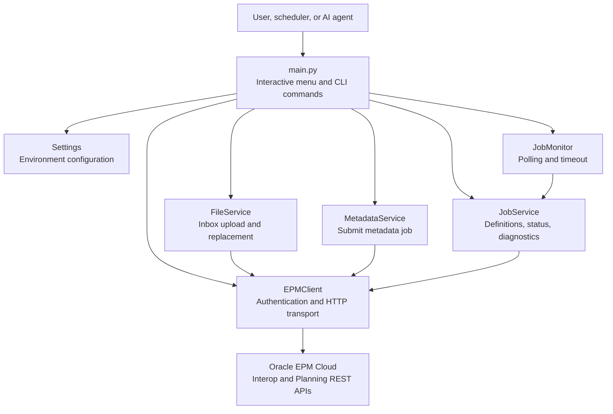
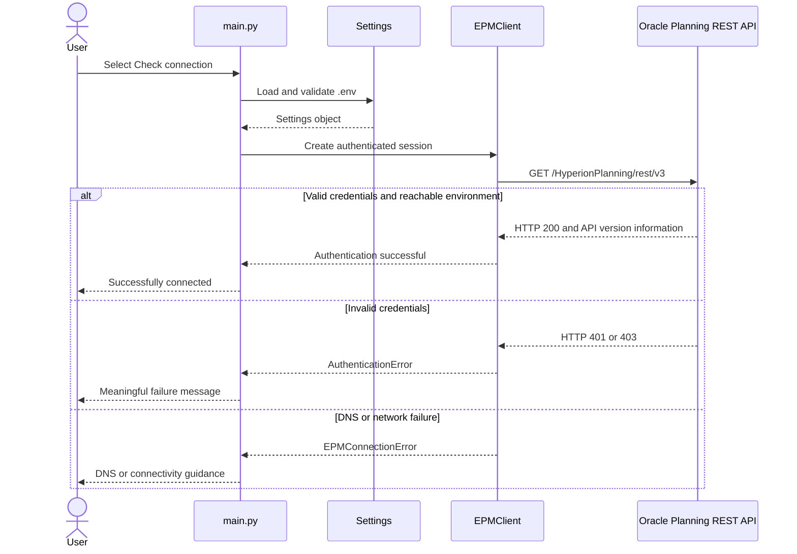
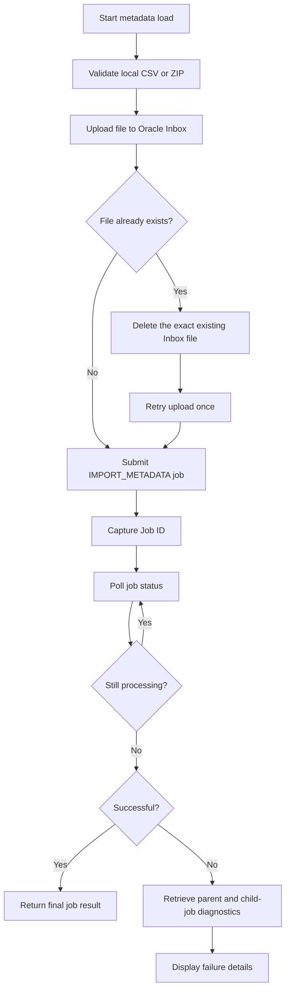
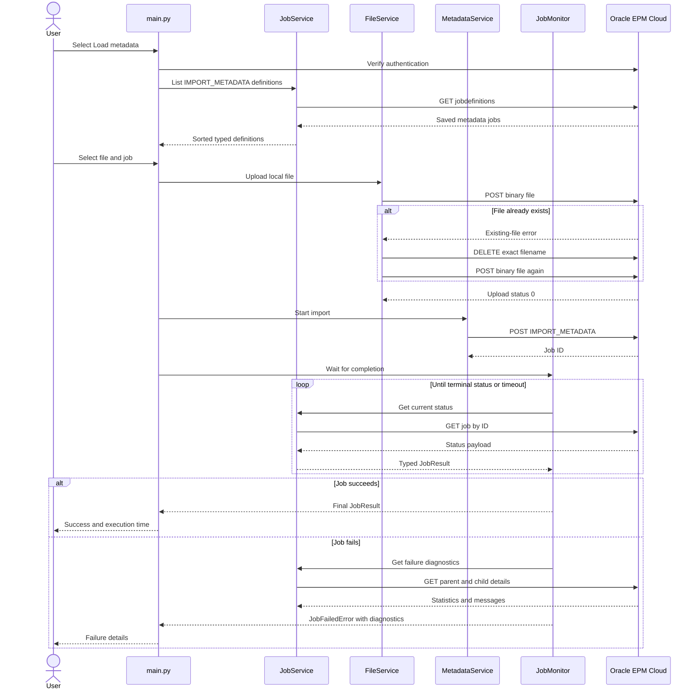

# From Scripts to a Framework: Building Oracle EPM Planning Automation with Python

## Part 1 — Secure Login and End-to-End Metadata Loading

Oracle EPM administrators often begin automation with a small script: create a
URL, attach a username and password, call an endpoint, and print the response.
That is a perfectly reasonable way to prove that an API works.

The difficulty begins when the automation grows.

A login script soon needs to upload files. File uploads need error handling.
Metadata imports return job IDs. Job IDs need polling. Failed jobs need useful
diagnostics. Credentials must stay outside the source code. Business Rules,
Data Maps, Pipelines, data loads, schedulers, and AI agents will eventually
need the same HTTP and monitoring behavior.

At that point, adding more code to one script becomes expensive and risky.

This series follows the development of a modular Oracle EPM Planning
Automation Framework in Python. The goal is not merely to make one API call
work. The goal is to build a foundation that remains understandable and
reusable as more Oracle EPM capabilities are added.

In this first article, we will build and explain:

- Environment-based configuration
- Centralized logging
- A reusable Oracle EPM HTTP client
- HTTP Basic Authentication
- Connection verification
- Interactive and non-interactive execution
- Metadata CSV/ZIP upload
- Existing Inbox file replacement
- Planning Import Metadata job submission
- Job polling, timeout handling, and failure diagnostics
- Automated unit testing

The implementation uses Python 3.11+, `requests`, `python-dotenv`, type hints,
dataclasses, custom exceptions, and dependency injection.

---

## 1. What we are building

The framework separates user interaction, application services, HTTP
communication, configuration, and domain models.



The most important architectural rule is:

> Services never call `requests` directly. They communicate through one
> reusable `EPMClient`.

This gives every future feature the same authentication, logging, timeout,
response parsing, and exception behavior.

---

## 2. A short glossary for beginners

| Term | Meaning |
|---|---|
| REST API | A web interface that lets software perform operations using HTTP requests. |
| Endpoint | The path for one API operation, such as retrieving a job status. |
| HTTP Basic Authentication | Authentication that sends an encoded username and password in the `Authorization` header over HTTPS. |
| Session | A reusable `requests.Session` that keeps authentication, headers, and network connections together. |
| Inbox | The Oracle EPM repository location from which jobs read uploaded files. |
| Outbox | The repository location where Oracle can place exports and error files. |
| Job ID | The numeric identifier Oracle returns for an asynchronous operation. |
| Polling | Repeatedly checking a job until it succeeds, fails, or times out. |
| Service | A class responsible for one business capability, such as uploading a file. |
| Model | A typed Python object representing API data, such as a job result. |

---

## 3. Project structure

The project is organized by responsibility:

```text
oracle-planning-automation/
├── app/
│   ├── clients/
│   │   └── epm_client.py
│   ├── config/
│   │   └── settings.py
│   ├── models/
│   │   ├── file_transfer.py
│   │   ├── job.py
│   │   └── metadata_job.py
│   ├── monitoring/
│   │   └── job_monitor.py
│   ├── services/
│   │   ├── file_service.py
│   │   ├── job_service.py
│   │   └── metadata_service.py
│   └── utils/
│       ├── exceptions.py
│       └── logger.py
├── tests/
├── .env
├── .env.example
├── main.py
├── requirements.txt
└── requirements-dev.txt
```

This layout may look larger than a single script, but it makes the code easier
to navigate:

- `clients` knows how to communicate with Oracle.
- `config` knows how to load settings.
- `models` describes the data returned by Oracle.
- `services` implements application capabilities.
- `monitoring` handles asynchronous jobs.
- `utils` contains cross-cutting logging and exceptions.
- `main.py` connects the pieces and interacts with the user.
- `tests` validates behavior without changing a real Oracle environment.

---

## 4. Prerequisites

Before running the project, we need:

- Python 3.11 or newer
- Network and DNS access to the Oracle EPM environment
- An Oracle EPM user with the required roles
- A Planning application
- A saved Planning Import Metadata job
- A metadata file in CSV or ZIP format

Create a virtual environment and install the dependencies:

```powershell
python -m venv .venv
.\.venv\Scripts\Activate.ps1
python -m pip install -r requirements.txt
```

The runtime dependencies are intentionally small:

```text
requests
python-dotenv
```

`pytest` is kept in `requirements-dev.txt` because it is required for
development and testing, not for normal execution.

---

## 5. Configuration without hardcoded credentials

Credentials must never be embedded in Python files. The framework reads them
from `.env`:

```dotenv
EPM_BASE_URL=https://your-epm-environment.example.com
EPM_USERNAME=your.username
EPM_PASSWORD=your.password
APPLICATION_NAME=Vision

EPM_REQUEST_TIMEOUT=30
EPM_VERIFY_SSL=true
LOG_LEVEL=INFO

DEFAULT_METADATA_IMPORT_MODE=job_definition
DEFAULT_POLL_INTERVAL=5
DEFAULT_JOB_TIMEOUT=1800
```

The real `.env` is excluded through `.gitignore`. `.env.example` documents the
required keys without containing secrets.

The `Settings` dataclass gives the rest of the application one validated
configuration object:

```python
@dataclass(frozen=True, slots=True)
class Settings:
    epm_base_url: str
    epm_username: str
    epm_password: str
    application_name: str
    request_timeout: float = 30.0
    verify_ssl: bool = True
    log_level: str = "INFO"
    default_metadata_import_mode: str = "job_definition"
    default_poll_interval: float = 5.0
    default_job_timeout: float = 1800.0
```

Why validate configuration early?

Without validation, a missing password or malformed URL may fail much later as
a confusing HTTP error. `Settings.from_env()` instead raises a
`ConfigurationError` before the workflow begins.

> Keep `EPM_VERIFY_SSL=true` in normal environments. Disabling certificate
> verification hides TLS problems and should not be used as a general
> connectivity fix.

---

# Part A — Login and connection verification

## 6. How Oracle EPM authentication works

Oracle EPM Cloud accepts HTTP Basic Authentication. Every request includes an
`Authorization` header derived from the configured username and password.

The framework does not manually build that header. It uses
`requests.auth.HTTPBasicAuth`:

```python
self._session.auth = HTTPBasicAuth(
    settings.epm_username,
    settings.epm_password,
)
```

Although the name says “Basic,” credentials are protected in transit by HTTPS.
TLS verification remains enabled by default.

## 7. Why use one `requests.Session`

A basic script might do this:

```python
requests.get(url, auth=HTTPBasicAuth(username, password))
```

That can work for one request. A framework uses a session:

```python
self._session = session or requests.Session()
self._session.auth = HTTPBasicAuth(
    settings.epm_username,
    settings.epm_password,
)
self._session.headers.update(
    {
        "Accept": "application/json",
        "User-Agent": "oracle-planning-automation/0.1.0",
    }
)
```

The session provides:

- Authentication reuse
- HTTP connection pooling
- Shared headers
- A single place for TLS and timeout behavior
- A test seam where a mocked session can be injected

This becomes increasingly valuable as one workflow performs many API calls.

## 8. Login sequence



The authentication method verifies the connection by retrieving Planning API
version information:

```python
def authenticate(self) -> Mapping[str, Any]:
    self._logger.info(
        "Authentication started for Planning application '%s'.",
        self.application_name,
    )

    version_info = self.get_api_version_information()
    self._authenticated = True

    self._logger.info(
        "Authentication successful for Planning application '%s'.",
        self.application_name,
    )
    return version_info
```

The verification endpoint is:

```text
GET /HyperionPlanning/rest/v3
```

This confirms four things before a business operation starts:

1. The base URL is usable.
2. DNS and HTTPS connectivity work.
3. Oracle accepts the credentials.
4. The user can access the Planning REST API.

## 9. HTTP and application errors are different

The client translates low-level errors into framework-specific exceptions:

| Situation | Framework exception |
|---|---|
| Missing or invalid `.env` value | `ConfigurationError` |
| HTTP 401 or 403 | `AuthenticationError` |
| Timeout, connection, or DNS failure | `EPMConnectionError` |
| Other HTTP/API failure | `APIRequestError` |

This keeps service code readable. A metadata service does not need to know the
details of `urllib3`, sockets, or HTTP adapters.

DNS failures receive a specific message:

```text
DNS resolution failed for Oracle EPM host '...'.
Verify EPM_BASE_URL and check the active VPN, corporate DNS,
or network DNS configuration.
```

The framework reports DNS accurately, but it does not modify Windows DNS,
flush the DNS cache, hardcode Oracle IP addresses, or bypass corporate network
policy.

## 10. Running a login check

Interactive mode:

```powershell
python main.py
```

Then select:

```text
1. Check connection
```

Non-interactive mode for scripts:

```powershell
python main.py login
```

Successful output:

```text
Successfully connected to Oracle Planning.
```

---

# Part B — End-to-end metadata loading

## 11. What a metadata load must do

Starting a metadata import requires more than one request:



Each box belongs to a focused component instead of one large function.

## 12. Selecting a file and job

Running `python main.py` opens:

```text
Oracle EPM Planning Automation

1. Check connection
2. Load metadata
3. Load data (Coming soon)
4. Run business rule (Coming soon)
0. Exit
```

After selecting metadata load, the user can:

1. Upload a local CSV or ZIP file.
2. Use a file already present in the Oracle Inbox.

For local files, the user can drag the file from Windows Explorer into the
terminal. Windows inserts the full path, and the program removes matching
quotes added around paths containing spaces.

The framework then calls Oracle’s job-definition endpoint and lists saved
`IMPORT_METADATA` jobs:

```text
Available Import Metadata jobs

1. Import Account Metadata
2. Import Entity Metadata
3. Import Daily Metadata
0. Cancel
```

This is safer than asking the user to type an exact, case-sensitive job name.

## 13. File validation

`FileService` accepts only CSV and ZIP files:

```python
_SUPPORTED_EXTENSIONS = frozenset({".csv", ".zip"})
```

Before contacting Oracle, it checks:

- The path exists.
- The path represents a file.
- The extension is supported.
- The extension comparison is case-insensitive.

Early validation avoids wasting an API request on an invalid local path.

## 14. Uploading to the Oracle Inbox

The file is streamed as binary content:

```python
with path.open("rb") as content:
    response = self._client.post_binary(endpoint, content)
```

The endpoint is:

```text
POST /interop/rest/11.1.2.3.600/applicationsnapshots/{filename}/contents
```

The request uses:

```text
Content-Type: application/octet-stream
```

Streaming is preferable to reading the entire file into memory, especially
when future file operations involve larger data or snapshot files.

## 15. Replacing an existing Inbox file

Oracle’s upload API reports an error when the target filename already exists;
it does not provide an atomic overwrite operation.

The framework handles this carefully:

1. Attempt the upload normally.
2. Inspect Oracle’s response.
3. Continue only if the response explicitly indicates that the file exists.
4. Delete that exact filename.
5. Reopen the local file.
6. Retry the upload once.

The delete endpoint is:

```text
DELETE /interop/rest/11.1.2.3.600/applicationsnapshots/{filename}
```

Conceptually, the logic is:

```python
result = self._upload_once(path, endpoint)

if (
    not result.is_successful
    and replace_existing
    and self._indicates_existing_file(result)
):
    self._delete_from_inbox(file_name)
    result = self._upload_once(path, endpoint)
```

The service does **not** delete a file when the upload fails because of:

- Invalid credentials
- Missing permissions
- DNS or network problems
- File validation
- An unrelated Oracle error

There is one operational caveat: delete followed by upload is not atomic. If
the network fails after deletion, the old Inbox copy is gone. The local source
file remains safe, and rerunning the command uploads it again.

## 16. Why a saved Import Metadata job is required

Oracle Planning’s Import Metadata REST operation expects:

- `jobType`
- The exact name of a saved Import Metadata job
- Optional supported overrides

The framework can list and execute job definitions, but Oracle does not expose
a documented Planning REST operation for creating an Import Metadata job
definition.

Create the job once in Planning and configure:

- Dimensions to import
- CSV filenames
- Delimiter and file behavior
- Clear Members behavior
- Refresh Database behavior

A useful naming convention is:

```text
Automation - Metadata Merge
Automation - Metadata Clear Members
Automation - Metadata Merge and Refresh
```

## 17. CSV and ZIP behavior

CSV and ZIP imports behave differently.

### CSV

For a CSV file, the saved Planning job must already reference the same
filename. Oracle’s metadata REST API does not provide a general runtime CSV
filename override.

### ZIP

For a ZIP file, the framework sends the documented `importZipFileName`
override:

```json
{
  "jobType": "IMPORT_METADATA",
  "jobName": "Import Daily Metadata",
  "parameters": {
    "importZipFileName": "DailyMetadata.zip",
    "errorFile": "DailyMetadataErrors.zip"
  }
}
```

The ZIP may contain metadata files for multiple dimensions, but the saved job
still controls which dimensions are configured for import.

## 18. Import mode belongs to the job definition

The configuration contains:

```dotenv
DEFAULT_METADATA_IMPORT_MODE=job_definition
```

This name is intentional. Oracle does not expose a single metadata
`importMode` parameter for overriding merge versus clear behavior at runtime.
Those choices belong to the saved Planning job.

The framework refuses unsupported values rather than sending undocumented
parameters that Oracle might reject or ignore.

## 19. Submitting the metadata job

`MetadataService` builds the request and posts it to:

```text
POST /HyperionPlanning/rest/v3/applications/{application}/jobs
```

Oracle returns a response similar to:

```json
{
  "jobId": 125,
  "status": -1,
  "descriptiveStatus": "Processing"
}
```

The service converts that response into a typed `MetadataJobSubmission`:

```python
@dataclass(frozen=True, slots=True)
class MetadataJobSubmission:
    job_id: int
    job_name: str
    file_name: str
    import_mode: MetadataImportMode
    error_file_name: str | None = None
```

Returning a dataclass is clearer than passing an unvalidated dictionary around
the application.

## 20. Monitoring the job

Oracle metadata imports are asynchronous. Receiving a Job ID means Oracle
accepted the request, not that the import finished.

`JobMonitor` repeatedly calls:

```text
GET /HyperionPlanning/rest/v3/applications/{application}/jobs/{jobId}
```

The primary Planning status codes are:

| Code | Meaning | Monitor action |
|---:|---|---|
| `-1` | In progress | Continue polling |
| `0` | Success | Return final result |
| `1` | Error | Retrieve diagnostics and fail |
| `2` | Cancel pending | Continue polling |
| `3` | Cancelled | Retrieve diagnostics and fail |
| `4` | Invalid parameter | Retrieve diagnostics and fail |
| `2147483647` | Unknown | Treat as a failed terminal state |

Polling is configurable:

```dotenv
DEFAULT_POLL_INTERVAL=5
DEFAULT_JOB_TIMEOUT=1800
```

The monitor receives its clock and sleep functions through dependency
injection. That allows tests to simulate 30 minutes in milliseconds without
actually waiting.

## 21. Retrieving failure diagnostics

When a metadata job fails, `JobService` retrieves parent details:

```text
GET /HyperionPlanning/rest/v3/applications/{application}/jobs/{jobId}/details
```

Metadata imports may create child jobs for individual dimensions. The service
follows the returned child links and requests their error messages:

```text
GET /HyperionPlanning/rest/v3/applications/{application}/jobs/
    {jobId}/childjobs/{childJobId}/details
```

This can provide:

- Dimension name
- Records read
- Records processed
- Records rejected
- Message type
- Message category
- Oracle error text

If one child-detail request fails, the service retains the parent details and
continues collecting other available messages.

## 22. Complete metadata sequence



---

## 23. Running the framework

### Interactive mode

```powershell
python main.py
```

This is ideal for a person running the framework from a terminal.

### Non-interactive login

```powershell
python main.py login
```

### Non-interactive local metadata load

```powershell
python main.py metadata `
  --file "C:\metadata\DailyMetadata.zip" `
  --job "Import Daily Metadata" `
  --error-file-name "DailyMetadataErrors.zip"
```

### Use a file already in the Inbox

```powershell
python main.py metadata `
  --inbox-file "DailyMetadata.zip" `
  --job "Import Daily Metadata"
```

Keeping non-interactive commands is essential for future:

- Windows Task Scheduler
- CI/CD pipelines
- Enterprise schedulers
- Batch scripts
- AI-agent tool calls

The menu and non-interactive commands call the same service classes, so they
cannot develop different business behavior.

---

## 24. Centralized logging

The framework logs:

- Application startup
- Authentication start and result
- HTTP method, URL, and response status
- File upload and replacement
- Metadata job submission
- Job ID
- Polling status
- Success or failure
- Execution time
- Available failure details

Example:

```text
INFO  Application started.
INFO  Authentication started for Planning application 'Vision'.
INFO  HTTP request: GET https://.../HyperionPlanning/rest/v3
INFO  Authentication successful for Planning application 'Vision'.
INFO  Metadata upload started: file='DailyMetadata.zip'.
WARNING Metadata file already exists and will be replaced.
INFO  Import Job ID: 125.
INFO  Current job status: job_id=125, status=-1.
INFO  Current job status: job_id=125, status=0.
INFO  Metadata import successful.
```

At `INFO`, expected failures remain readable. Full exception tracebacks are
available when:

```dotenv
LOG_LEVEL=DEBUG
```

Credentials are never written to logs.

---

## 25. Testing without touching Oracle

Unit tests use mocked sessions and services. They do not upload a file or
execute a real Oracle job.

Run them with:

```powershell
python -m pip install -r requirements-dev.txt
python -m pytest
```

At the time of this article, the suite contains 40 passing tests covering:

- Configuration validation
- Basic Authentication and session reuse
- HTTP response and connection errors
- Binary upload behavior
- Exact-file replacement
- Metadata payload construction
- Job-definition discovery
- Job response parsing
- Success, failure, and timeout polling
- Parent and child diagnostics
- Interactive menu behavior
- Non-interactive commands

Testing at these boundaries lets future features reuse trusted infrastructure.

---

## 26. Common problems

### DNS resolution fails

Symptom:

```text
getaddrinfo failed
```

This occurs before Oracle receives the credentials. Check the configured URL,
VPN, corporate DNS, and network adapter DNS settings. Do not solve it by
hardcoding Oracle’s current IP address.

### HTTP 401 or 403

Check:

- Username and password
- Identity-domain username format
- Service Administrator or required application role
- Application access

### No Import Metadata jobs are listed

Create and save an Import Metadata job in Planning. The framework can list and
execute definitions but does not create them through an undocumented UI
automation process.

### CSV uploads but the wrong file is imported

The saved Planning job must reference the same CSV filename. Use a ZIP and the
supported `importZipFileName` override when runtime filename flexibility is
required.

### The job never finishes

Increase `DEFAULT_JOB_TIMEOUT` if the job is legitimately long-running.
Otherwise, inspect the Planning Job Console and environment health.

### The existing Inbox file was deleted but the retry failed

Oracle does not offer an atomic overwrite. Rerun the command; the local file
was not changed and will be uploaded again.

---

## 27. Why this design is ready to grow

Future features can reuse existing building blocks:

| Future feature | Components already reusable |
|---|---|
| Import Data | `EPMClient`, `FileService`, `JobService`, `JobMonitor` |
| Business Rules | `EPMClient`, `JobService`, `JobMonitor` |
| Data Maps | `EPMClient`, `JobService`, `JobMonitor` |
| Pipelines | `EPMClient`, typed models, monitoring patterns |
| Snapshot Management | `EPMClient`, binary file transport, exceptions |
| Scheduling | Non-interactive CLI and service layer |
| AI-agent orchestration | Stable service methods and typed results |

Adding a Business Rule should not require rewriting authentication. Adding
data load should not require another polling loop. Adding an AI agent should
not give the model direct access to raw passwords or low-level HTTP calls.

That is the difference between a working script and an automation framework.

---

## 28. Current scope and roadmap

Implemented:

- Basic Authentication
- Connection verification
- Interactive menu
- Non-interactive commands
- Metadata file upload
- Exact-file replacement
- Import Metadata job selection and execution
- Job monitoring
- Failure diagnostics

Not implemented yet:

- Data loading
- Business Rules
- Data Maps
- Pipelines
- File download
- Scheduling
- OAuth 2
- AI-agent orchestration

Each future milestone will become another article in this series.

---

## Conclusion

We began with a simple requirement—log in to Oracle Planning—and used it to
establish a reusable client, validated configuration, centralized logging, and
custom exceptions.

We then added metadata loading without breaking that foundation. Upload,
replacement, job execution, job discovery, polling, and diagnostics live in
focused classes that can be reused by later automation features.

The result is still approachable for a beginner, but it no longer behaves like
a one-time script. It is the beginning of a production-quality Oracle EPM
automation platform.

---

## Official Oracle references

- [Basic Authentication for Oracle EPM Cloud REST APIs](https://docs.oracle.com/en/cloud/saas/enterprise-performance-management-common/prest/authentication_overview.html)
- [Upload files through the Interop REST API](https://docs.oracle.com/en/cloud/saas/enterprise-performance-management-common/prest/upload.html)
- [Delete files through the Interop REST API](https://docs.oracle.com/en/cloud/saas/enterprise-performance-management-common/prest/delete_files.html)
- [Import Metadata](https://docs.oracle.com/en/cloud/saas/enterprise-performance-management-common/prest/import_metadata.html)
- [Get Job Definitions](https://docs.oracle.com/en/cloud/saas/enterprise-performance-management-common/prest/get_job_definitions.html)
- [Retrieve Job Status](https://docs.oracle.com/en/cloud/saas/enterprise-performance-management-common/prest/retrieve_job_status.html)
- [Retrieve Job Status Details](https://docs.oracle.com/en/cloud/saas/enterprise-performance-management-common/prest/retrieve_job_status_details.html)

---

## Continue the series

Next: [Part 2 — Two Execution Engines and Native Planning Data Loads](part-02-epm-automate-native-data-load.md)
