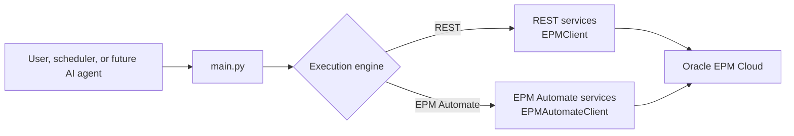
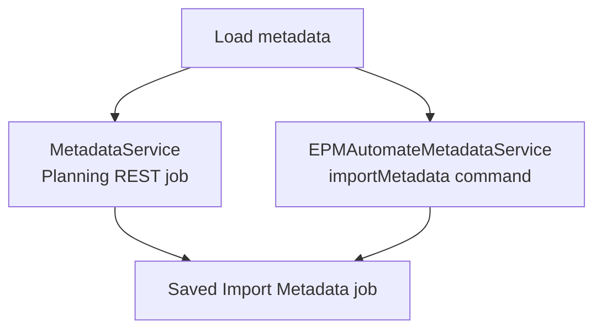
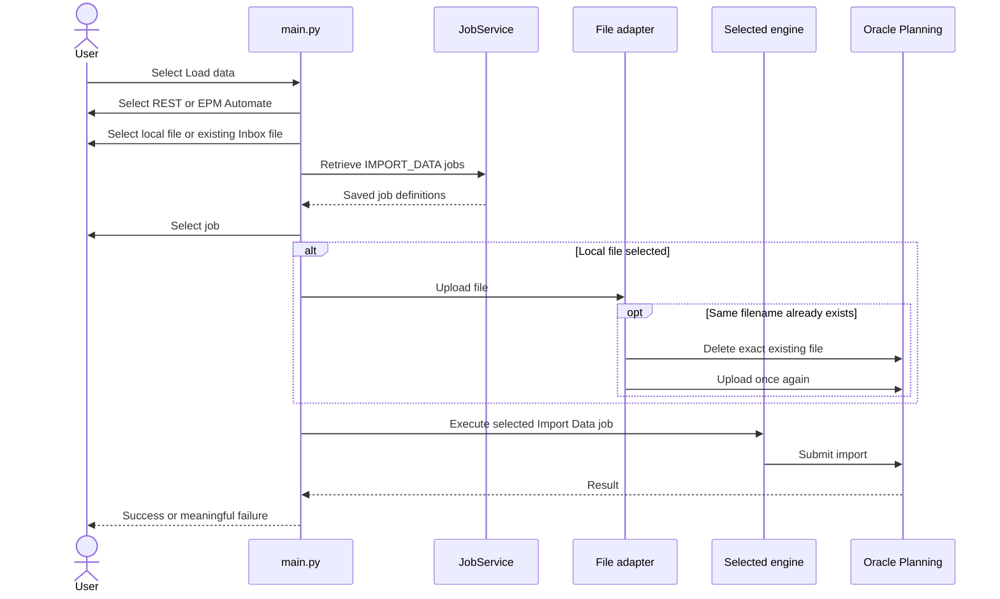

# From Scripts to a Framework: Building Oracle EPM Planning Automation with Python

## Part 2 — Two Execution Engines and Native Planning Data Loads

In [Part 1](part-01-foundations-login-metadata-load.md), we built the
foundation: validated configuration, centralized logging, a reusable REST
client, Oracle Planning login verification, file upload, metadata import, job
monitoring, and failure diagnostics.

This article adds two important capabilities:

1. Oracle EPM Automate as a second execution engine.
2. Native Oracle Planning data imports through either REST or EPM Automate.

The purpose is not to make the user maintain two separate programs. Both
engines sit behind the same menu and the same application services.

---

## 1. What “two execution engines” means

An execution engine is the mechanism that sends an operation to Oracle:

- **REST** uses HTTPS requests directly from Python.
- **EPM Automate** runs Oracle’s installed command-line utility.

The business intent remains the same:

```text
Upload this file, run this saved import job, and report the result.
```

Only the adapter used to communicate with Oracle changes.



This is a practical application of the Dependency Inversion Principle: the
workflow depends on stable Python abstractions instead of being tied to one
transport.

---

## 2. When to use each engine

| Consideration | REST | EPM Automate |
|---|---|---|
| Additional installation | No | Yes |
| Direct JSON responses | Yes | No, command output and exit codes |
| Encrypted password file | Not used by the current REST client | Yes |
| Suitable for services and APIs | Excellent | Good when the utility is installed |
| Interactive job discovery | Yes | Uses REST discovery in this framework |
| Oracle command parity | Depends on available REST endpoint | Strong for documented commands |

REST remains the natural default for a Python application. EPM Automate is
valuable because many EPM administrators already use it, Oracle documents its
commands, and it provides another supported execution route.

The framework does not mix the two accidentally. The selected engine is
explicit in the menu, CLI arguments, logs, and completion notification.

---

## 3. EPM Automate prerequisites

Before selecting EPM Automate:

- Install EPM Automate on the machine running Python.
- Confirm the EPM user has the role required by the command.
- Create an encrypted `.epw` password file.
- Keep that password file outside the project.
- Configure the executable and encrypted-file paths in `.env`.

Example:

```dotenv
DEFAULT_METADATA_ENGINE=rest
DEFAULT_DATA_ENGINE=rest

EPM_AUTOMATE_EXECUTABLE=C:\Program Files\Oracle\EPM Automate\bin\epmautomate.bat
EPM_AUTOMATE_PASSWORD_FILE=C:\Secure\EPMPassword.epw
EPM_AUTOMATE_COMMAND_TIMEOUT=1800
```

If the executable is already on `PATH`, this is sufficient:

```dotenv
EPM_AUTOMATE_EXECUTABLE=epmautomate
```

### Create the encrypted password file

This is a one-time administrative action performed in a private terminal:

```powershell
epmautomate encrypt "YOUR_PASSWORD" "YOUR_PRIVATE_KEY" "C:\Secure\EPMPassword.epw"
```

The real password and private key must not be placed in source code,
documentation, screenshots, logs, or chat messages. The framework receives
only the path to the resulting `.epw` file.

Oracle’s login command accepts an encrypted password file, and Oracle
recommends an encrypted password or OAuth refresh token for unattended
automation. The current framework uses the encrypted-file option.

---

## 4. Running commands safely from Python

`EPMAutomateRunner` is the process boundary:

```python
completed = subprocess.run(
    command_arguments,
    check=False,
    capture_output=True,
    text=True,
    timeout=self._timeout,
    shell=False,
)
```

Important design choices:

- `shell=False` avoids unnecessary command-shell parsing.
- Arguments are passed as a list, so spaces in paths remain one argument.
- Standard output and error are captured for diagnostics.
- Every command has a timeout.
- Exit codes are normalized into a typed result.
- Logs record the command name, not credentials or the full login arguments.

Possible failures become meaningful framework exceptions:

| Failure | Exception |
|---|---|
| Executable missing | `EPMAutomateNotInstalledError` |
| Login rejected | `EPMAutomateAuthenticationError` |
| Command exit code indicates failure | `EPMAutomateCommandError` |
| Command exceeds timeout | `EPMAutomateTimeoutError` |

---

## 5. An authenticated EPM Automate session

Every command workflow follows:

```text
login → upload if required → execute operation → logout
```

`EPMAutomateClient` implements this as a context manager:

```python
with self._client:
    self._client.upload_file(file_path)
    result = self._client.run("importData", job_name, file_name)
```

The context manager attempts logout even when upload or import fails. A logout
problem is logged as a warning and does not hide the more important operation
failure.

The framework also removes a trailing `/HyperionPlanning` from the configured
URL before EPM Automate login because the utility expects the environment base
URL.

---

## 6. Metadata import through EPM Automate

Metadata import now has two implementations:



The EPM Automate equivalent is:

```text
epmautomate importMetadata JOB_NAME [ZIP_FILE] [errorFile=ERROR_FILE.zip]
```

The distinction between CSV and ZIP remains important:

- For CSV, the saved Import Metadata job controls the configured filenames.
- For ZIP, the filename can be supplied as the documented runtime override.
- Merge, clear-members, and refresh behavior still belongs to the saved job.

The framework deliberately does not invent unsupported import modes.

---

## 7. Native Planning data load versus Data Integration

These are different Oracle features.

| Native Planning Import Data | Data Integration |
|---|---|
| Executes a Planning `IMPORT_DATA` job | Executes a Data Integration definition |
| File is interpreted by Planning’s saved job | File is interpreted by the integration’s import format and mappings |
| No Data Integration staging workflow | Includes Data Integration staging/mapping behavior |
| Covered in this article | Covered in Part 3 |

Use native import when a saved Planning Import Data job already matches the
file and the required loading behavior. Use Data Integration when mappings,
multi-column processing, source integration, or Data Management capabilities
are required.

---

## 8. What must exist in Planning

For the current native data workflow, create and test an **Import Data** job in
Oracle Planning first.

Confirm:

- The target cube is correct.
- The source type matches the file.
- The delimiter and data format are correct.
- The import behavior is correct.
- The EPM user can execute the job.
- A representative file succeeds when run manually.

The framework discovers saved jobs by requesting definitions of type:

```text
IMPORT_DATA
```

It then displays a numbered list:

```text
Available Import Data jobs

1. Import Plan1 Data
2. Import Workforce Data
0. Cancel
```

When EPM Automate is selected interactively, REST is used only for this
supported discovery step. The selected job is then executed through EPM
Automate.

---

## 9. Native data-load sequence



---

## 10. REST implementation

The REST service builds a Planning job payload:

```python
payload = {
    "jobType": "IMPORT_DATA",
    "jobName": normalized_job_name,
    "parameters": {
        "importFileName": normalized_file_name,
    },
}
```

If requested, it also includes:

```python
parameters["errorFile"] = error_file_name
```

Oracle returns a job ID. The existing `JobMonitor` polls that job, applies the
configured timeout, and retrieves diagnostics on failure.

This reuse is the payoff from Part 1: data import needs a new focused service,
not another HTTP client or polling implementation.

---

## 11. EPM Automate implementation

The equivalent command is:

```text
epmautomate importData JOB_NAME FILE_NAME errorFile=ERROR_FILE.zip
```

The service:

1. Validates exactly one source: a local file or existing Inbox file.
2. Accepts `.csv`, `.txt`, or `.zip`.
3. Logs in with the encrypted password file.
4. Uploads a local file when needed.
5. Replaces an exact same-name Inbox file when Oracle reports a collision.
6. Runs `importData`.
7. Logs out.
8. Returns a typed result.

The Python program does not decide whether the load should overwrite, add, or
subtract Planning data. That is functional configuration owned by the saved
job.

---

## 12. Existing-file replacement works in both engines

Oracle upload operations do not silently overwrite an existing file.

Both adapters follow the same guarded policy:

```text
Attempt upload
    ↓
Did Oracle explicitly report “already exists”?
    ├── No  → return the original error
    └── Yes → delete that exact filename → retry upload once
```

The REST engine uses the Interop upload/delete APIs. The EPM Automate engine
uses:

```text
uploadFile
deleteFile
uploadFile
```

Deletion is never attempted for an unrelated authentication, permission,
network, or format error.

---

## 13. Running native data imports

### Interactive

```powershell
python main.py
```

Select:

```text
3. Load data
```

Then choose the execution engine, file source, and saved Import Data job.

### REST command

```powershell
python main.py data `
  --engine rest `
  --file "C:\EPM\PlanData.csv" `
  --job "Import Plan1 Data"
```

### EPM Automate command

```powershell
python main.py data `
  --engine epmautomate `
  --file "C:\EPM\PlanData.csv" `
  --job "Import Plan1 Data"
```

### Use an existing Oracle Inbox file

```powershell
python main.py data `
  --engine rest `
  --inbox-file "PlanData.csv" `
  --job "Import Plan1 Data"
```

Non-interactive execution requires an explicit job because there is no user
available to choose from a menu.

---

## 14. Common failures

### EPM Automate cannot be found

Set `EPM_AUTOMATE_EXECUTABLE` to the full `.bat` path or add EPM Automate to
`PATH`.

### The encrypted password file is missing

Confirm `EPM_AUTOMATE_PASSWORD_FILE` points to an existing `.epw` file. If the
EPM password changed, create a new encrypted file.

### The file uploads but the job fails

Check the saved Planning job:

- Filename or override
- Cube
- Delimiter
- Source type
- Member names
- Data format

The automation transports and runs the request; it cannot make an incompatible
file match an incorrectly configured job.

### The wrong job was selected

Use the interactive numbered list, or pass the exact job name through `--job`.

### A command times out

Increase `EPM_AUTOMATE_COMMAND_TIMEOUT` only after confirming that the Oracle
job is genuinely still processing and the network is stable.

---

## 15. Testing the dual-engine design

The tests do not run real EPM imports. They inject:

- Mock HTTP sessions
- Mock EPM Automate process runners
- Temporary local files
- Simulated Oracle responses and exit codes

Tests verify:

- Exact command order and arguments
- Login and logout behavior
- Replacement only after an existing-file response
- Supported extensions
- Timeout and exit-code translation
- REST job payloads
- Job selection
- No regression in login or metadata workflows

This makes refactoring safe without requiring a disposable Oracle environment
for every unit test.

---

## 16. What the architecture gains

The project now has three layers of intent:

```text
User intent
  “Load Planning data”

Application service
  Validate source and coordinate the workflow

Infrastructure adapter
  REST request or EPM Automate command
```

Future operations can follow the same pattern. Business Rules, Data Maps, and
Pipelines can receive a service and one or more supported adapters without
adding subprocess or HTTP details to `main.py`.

---

## Current scope

Implemented by the end of this article:

- Login and REST connection verification
- Metadata import through REST
- Metadata import through EPM Automate
- Native Planning data import through REST
- Native Planning data import through EPM Automate
- Interactive saved-job discovery
- Non-interactive commands
- Existing-file replacement
- Job monitoring and diagnostics

Next, we will implement file-based Data Integration without hardcoding how
many dimension or period columns exist in the source file.

---

## Official references

- [Oracle EPM Automate login](https://docs.oracle.com/en/cloud/saas/enterprise-performance-management-common/cepma/epm_auto_login.html)
- [Oracle EPM Automate command usage](https://docs.oracle.com/en/cloud/saas/enterprise-performance-management-common/cepma/epm_automate_command_usage.html)
- [Oracle EPM Automate Import Data](https://docs.oracle.com/en/cloud/saas/enterprise-performance-management-common/cepma/epm_auto_import_data.html)
- [Oracle EPM Automate uploadFile](https://docs.oracle.com/en/cloud/saas/enterprise-performance-management-common/cepma/epm_auto_upload_file.html)
- [Oracle Planning Import Data REST API](https://docs.oracle.com/en/cloud/saas/enterprise-performance-management-common/prest/import_data.html)
- [Oracle Planning job APIs](https://docs.oracle.com/en/cloud/saas/enterprise-performance-management-common/prest/manage_jobs.html)

---

## Continue the series

Next: [Part 3 — Flexible Data Integration Loads Without Hardcoded File Layouts](part-03-data-integration.md)
