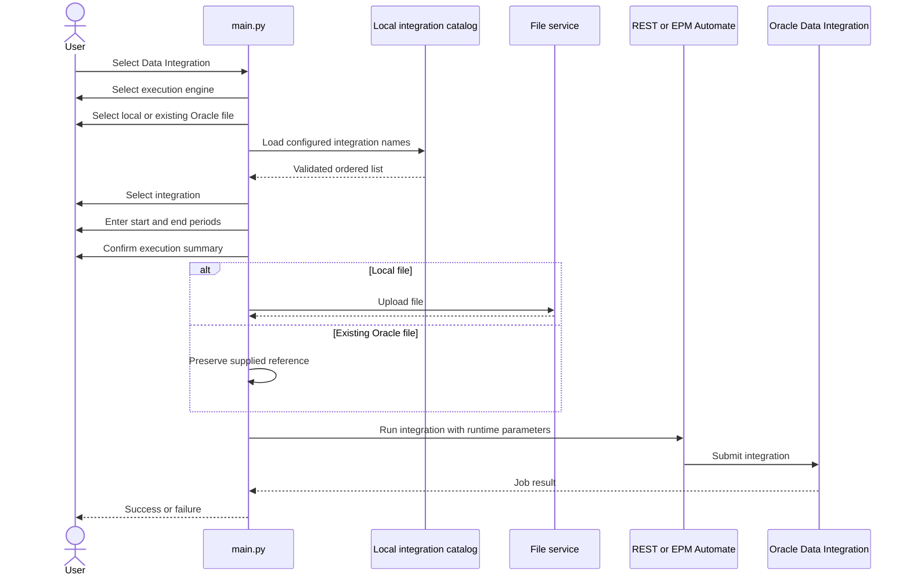

# From Scripts to a Framework: Building Oracle EPM Planning Automation with Python

## Part 3 — Flexible Data Integration Loads Without Hardcoded File Layouts

[Part 2](part-02-epm-automate-native-data-load.md) added EPM Automate and
native Planning data imports. This article adds file-based **Data Integration
/ Data Management** execution through both REST and EPM Automate.

The most important requirement is flexibility:

> Python must not assume that dimensions are always in columns 1–5 or that
> every file contains exactly three period columns.

Those rules belong to the Data Integration definition created by the Oracle
administrator.

---

## 1. Native Planning import and Data Integration are not the same

| Native Planning Import Data | Data Integration |
|---|---|
| Runs a Planning `IMPORT_DATA` job | Runs an `INTEGRATION` definition |
| Planning interprets the import file | Data Integration import format interprets the file |
| Limited transformation layer | Supports mappings, staging, period mapping, and source logic |
| Uses a Planning job definition | Uses an integration, import format, mappings, and target application |

The Python framework supports both. The user chooses the operation that
matches the Oracle configuration.

---

## 2. What must be configured in Oracle first

Before automating an integration, create and manually test it in Data
Integration.

For a file-based Standard Mode integration, confirm:

- Integration name
- Source type
- Target application
- Target cube
- File directory
- Expected file extension
- Delimiter
- Import format
- Dimension mapping
- Member mapping
- Period mapping
- Import mode
- Export mode
- Required user permissions

For example:

```text
Integration: Test_DataLoad
Source: File-based
Target application: Load_Vision
Target cube: Plan1
Delimiter: Comma
Import mode: Replace
Export mode: Merge
```

The current framework implementation is designed and tested around
file-based **Standard Mode** integrations.

---

## 3. Why the import format matters—but not to Python

Suppose an administrator configures:

```text
Import format: Multi-Column – Numeric
Driver=Period;Column=6,8;
```

That tells Oracle how to interpret columns 6 through 8 as period data. It does
not tell Python to parse those columns.

Another integration might be:

```text
Dimensions: columns 1–3
Amount: column 4
Format: Delimited – Numeric
```

And another:

```text
Dimensions: columns 1–6
Periods: columns 7–18
Format: Multi-Column – Numeric
```

All can use the same Python workflow because Python only performs transport
and orchestration:


Oracle remains responsible for:

- Dimension columns
- Amount or period columns
- Delimiters
- Header interpretation
- Multi-column expansion
- Member mappings
- Period mappings
- Target cube

The framework does not inspect or rewrite the source data.

---

## 4. End-to-end integration workflow



The confirmation screen shows the exact engine, integration, file, modes, and
period expression before anything runs.

---

## 5. Runtime period selection

The user provides the exact starting and ending period names configured in
Data Integration:

```text
Start period: Jun-19
End period: Aug-19
```

The framework creates Oracle’s required expression:

```text
{Jun-19}{Aug-19}
```

For one period:

```text
{Jun-19}
```

Planning member notation is also accepted:

```text
{Jan#FY26}{Mar#FY26}
```

Standard `Mon-YY` values receive additional chronological validation, so an
end period earlier than the start period is rejected before submission.
Administrator-defined period labels are preserved rather than guessed.

### Does the selected range have to equal the number of file columns?

The Python framework intentionally does not enforce that relationship.

For a multi-column import, the mapping between file columns and periods is
owned by Oracle’s import format and Column Headers configuration. The selected
runtime range must be compatible with that Oracle configuration, but the file
can contain one, three, twelve, or another number of data columns.

---

## 6. Import and export modes

For the current Standard Mode workflow, both values are supplied.

Supported import modes:

```text
Append
Replace
Map and Validate
No Import
```

Supported export modes:

```text
Merge
Replace
Accumulate
Subtract
No Export
Check
```

The framework normalizes capitalization and rejects unsupported values before
contacting Oracle:

```python
normalized_import = DataIntegrationService.normalize_import_mode(
    import_mode
)
normalized_export = DataIntegrationService.normalize_export_mode(
    export_mode
)
```

Default values live in `.env`:

```dotenv
DEFAULT_DATA_INTEGRATION_ENGINE=epmautomate
DEFAULT_DATA_INTEGRATION_NAME=Test_DataLoad
DEFAULT_DATA_INTEGRATION_IMPORT_MODE=Replace
DEFAULT_DATA_INTEGRATION_EXPORT_MODE=Merge
```

---

## 7. Oracle has multiple file locations

This was the source of an important real-world failure.

The Applications Inbox/Outbox repository is not the same location as the Data
Integration `inbox` directory. The runtime reference must identify the correct
location.

| File location | Runtime reference |
|---|---|
| Uploaded by this framework to Applications Inbox/Outbox | `#epminbox/FileName.csv` |
| Existing Data Integration inbox file | `inbox/FileName.csv` |
| Existing file in a directory configured by the integration | `FileName.csv` |

When Python uploads a local file, it creates:

```python
DataIntegrationFileReference.from_default_upload(file_name)
```

which resolves to:

```text
#epminbox/FileName.csv
```

If the user selects an existing Oracle file, the supplied `inbox/...`,
`#epminbox/...`, or plain filename is preserved.

This distinction prevents the common situation where the file is visible in
Inbox/Outbox Explorer but Data Integration reports that it cannot find it.

---

## 8. Existing files are replaced safely

Local Data Integration files use the same exact-file replacement behavior as
metadata and native data loads:

1. Try the upload.
2. Replace only when Oracle explicitly reports that the filename exists.
3. Delete that exact remote file.
4. Retry once.

For every other failure, the original error is returned without deleting
anything.

The EPM Automate `uploadFile` command also does not overwrite an identical
filename, so its adapter applies the equivalent `deleteFile` and retry
sequence.

---

## 9. REST implementation

The REST service posts to:

```text
POST /aif/rest/V1/jobs
```

Its payload contains:

```python
payload = {
    "jobType": "INTEGRATION",
    "jobName": integration_name,
    "periodName": period_range.oracle_period_name,
    "importMode": import_mode,
    "exportMode": export_mode,
    "fileName": file_reference,
}
```

The returned job ID is monitored using the reusable `JobMonitor`. The Data
Integration service implements the same small monitoring contract as the
Planning job service:

```text
get_job_status(job_id)
get_failure_diagnostics(job)
```

That allows one monitor to work with both APIs even though their endpoints and
response details differ.

---

## 10. EPM Automate implementation

The equivalent operation is:

```text
epmautomate runIntegration Test_DataLoad importMode=Replace exportMode=Merge periodName={Jun-19}{Aug-19} inputFileName=#epminbox/Test_Sales_DataLoad_V2.csv
```

The service:

- Logs in using the encrypted password file.
- Uploads the local source when required.
- Builds a validated file reference.
- Executes `runIntegration`.
- Interprets the exit code and output.
- Logs out even after a failure.
- Returns a typed result.

No command is assembled as one shell string. Each parameter is a distinct
process argument.

---

## 11. Selecting integrations without typing their names

Planning exposes an API for retrieving job definitions, which is why metadata
and native data jobs can be discovered live.

Oracle’s currently documented public Data Integration REST and EPM Automate
interfaces support running integrations but do not provide a supported
“list every integration definition” operation.

The framework therefore uses a local, validated catalog:

```json
{
  "integrations": [
    {
      "name": "Test_DataLoad",
      "description": "Sales data load"
    },
    {
      "name": "Test_Load_Product_Revenue",
      "description": "Product revenue load"
    }
  ]
}
```

The file is:

```text
config/data_integrations.json
```

Interactive output:

```text
Available Data Integrations

1. Test_DataLoad - Sales data load
2. Test_Load_Product_Revenue - Product revenue load
3. Enter another integration name

Select an integration [1]:
```

Pressing Enter chooses the configured default. Manual entry remains available
when an administrator creates a new integration before the catalog is
updated.

The catalog path can be changed:

```dotenv
DATA_INTEGRATION_CATALOG_FILE=config/data_integrations.json
```

Relative paths are resolved from the project root. The loader validates JSON,
required names, optional descriptions, and case-insensitive duplicates.

This approach is more reliable than scraping Oracle’s browser interface or
calling undocumented internal endpoints.

---

## 12. Running Data Integration

### Interactive

```powershell
python main.py
```

Select:

```text
4. Run Data Integration / Data Management
```

The program asks for:

1. REST or EPM Automate
2. Local or existing Oracle file
3. Integration from the catalog
4. Starting and ending periods
5. Final confirmation

### EPM Automate command

```powershell
python main.py integration `
  --engine epmautomate `
  --file "C:\EPM\Test_Sales_DataLoad_V2.csv" `
  --integration-name "Test_DataLoad" `
  --start-period "Jun-19" `
  --end-period "Aug-19"
```

### REST command

```powershell
python main.py integration `
  --engine rest `
  --file "C:\EPM\Test_Sales_DataLoad_V2.csv" `
  --integration-name "Test_DataLoad" `
  --start-period "Jun-19" `
  --end-period "Aug-19"
```

### Existing Data Integration file

```powershell
python main.py integration `
  --engine epmautomate `
  --inbox-file "inbox/Test_Sales_DataLoad_V2.csv" `
  --integration-name "Test_DataLoad" `
  --start-period "Jun-19" `
  --end-period "Aug-19"
```

The non-interactive command keeps `--integration-name` so schedulers and
future agents remain deterministic.

---

## 13. Troubleshooting

### “Unable to open file”

First determine where the file exists:

- Applications Inbox/Outbox → use `#epminbox/FileName.csv`
- Data Integration inbox → use `inbox/FileName.csv`
- Integration-configured directory → use the appropriate configured reference

Do not remove location prefixes blindly.

### Manual execution succeeds but Python fails

Compare the exact values:

- Integration name
- File reference
- Start/end period names
- Import mode
- Export mode
- Environment URL and user

The framework’s confirmation summary and logs expose these values without
exposing credentials.

### Different file layouts fail

The Python program does not impose a layout. Review the Oracle import format,
dimension mapping, column headers, delimiter, and the selected integration.

### No integrations appear in the menu

Open `config/data_integrations.json`, validate the JSON, and add the exact
Oracle integration names. This list is local, not downloaded from Oracle.

### EPM Automate creates a command log

Oracle EPM Automate can create command-specific log files after failures.
Review those logs together with the framework log and the Data Integration
process details.

---

## 14. Tests added for this capability

The automated tests cover:

- Single and multi-period expressions
- Cross-year standard monthly ranges
- Planning period notation
- Invalid reversed ranges
- Import/export mode normalization
- Arbitrary source file extensions
- No hardcoded dimension or data-column counts
- Applications Inbox `#epminbox` references
- Existing `inbox/...` references
- REST payloads and monitoring
- EPM Automate command arguments
- Logout on failure
- Catalog parsing, ordering, descriptions, duplicates, and manual selection

At this milestone, the complete project suite contains **107 passing tests**.

---

## 15. Design lesson

The automation framework owns:

- Secure configuration
- User interaction
- File transport
- Runtime parameters
- Execution
- Monitoring
- Error reporting

Oracle Data Integration owns:

- File semantics
- Import formats
- Dimension mapping
- Member mapping
- Period-column mapping
- Target application and cube

Keeping that boundary clear prevents Python from becoming a second,
incomplete implementation of Data Integration.

---

## Current scope

Implemented:

- File-based Standard Mode integration execution
- REST and EPM Automate engines
- Runtime period selection
- Validated import/export modes
- Flexible file layouts and extensions
- Correct Oracle repository references
- Existing-file replacement
- Configurable interactive integration catalog
- Manual integration-name fallback
- Non-interactive commands

Not implemented yet:

- Automatic discovery of integration definitions
- Quick Mode-specific workflow
- Data Integration definition creation
- Downloading process logs or rejected-record files
- Pipelines

---

## Official references

- [Oracle Data Integration and Data Management REST APIs](https://docs.oracle.com/en/cloud/saas/enterprise-performance-management-common/prest/fdmee_rest_apis.html)
- [Oracle EPM Automate runIntegration](https://docs.oracle.com/en/cloud/saas/enterprise-performance-management-common/cepma/epm_auto_run_integration.html)
- [Oracle EPM Automate default file locations](https://docs.oracle.com/en/cloud/saas/enterprise-performance-management-common/cepma/epm_automate_command_about_default_upload_location.html)
- [Oracle EPM Automate uploadFile](https://docs.oracle.com/en/cloud/saas/enterprise-performance-management-common/cepma/epm_auto_upload_file.html)

---

## Continue the series

Next: [Part 4 — Operational Email Notifications That Do Not Hide Job Results](part-04-email-notifications.md)
