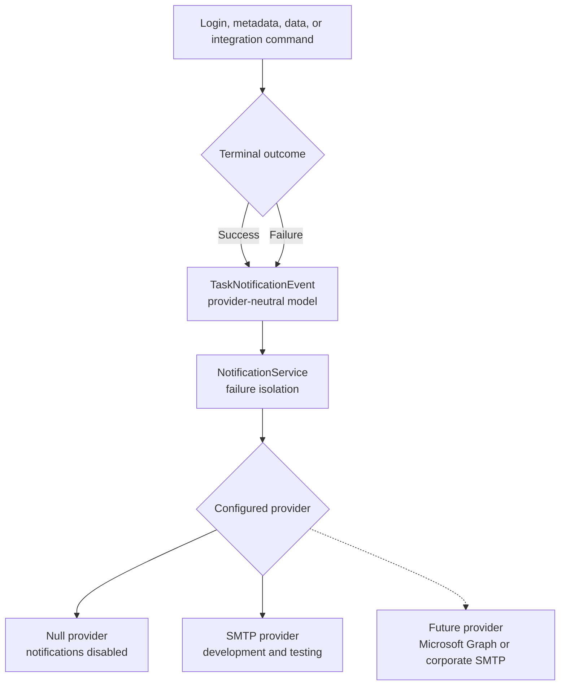

# From Scripts to a Framework: Building Oracle EPM Planning Automation with Python

## Part 4 — Operational Email Notifications That Do Not Hide Job Results

By the end of [Part 3](part-03-data-integration.md), the framework could run
login checks, metadata imports, native Planning data imports, and Data
Integration loads.

That solves execution, but unattended automation needs a way to tell people
what happened.

This article adds optional email messages whenever an executed task reaches a
terminal outcome:

- `SUCCESS`
- `FAILED`

The notification system is deliberately separate from Oracle operations so a
temporary mail problem never changes a successful EPM job into a failed one.

---

## 1. Notification policy

The framework follows four rules:

1. Send a notification only after a task succeeds or fails.
2. Do not send a success message for a user-cancelled operation.
3. Include useful operational context, but never credentials.
4. If email delivery fails, log it without replacing the original task result.

The last rule is essential.

If an Oracle data load succeeds but Gmail is temporarily unavailable, the
data load is still successful. Conversely, if Oracle fails and the email also
fails, the user must still see the Oracle failure—not only an SMTP error.

---

## 2. Architecture



The command layer creates an event. It does not know how SMTP works.

The provider interface is intentionally small:

```python
class NotificationProvider(Protocol):
    def send(self, event: TaskNotificationEvent) -> None:
        ...
```

That makes a future Microsoft 365 or corporate adapter an addition instead of
a rewrite.

---

## 3. The notification event

`TaskNotificationEvent` contains:

| Field | Example |
|---|---|
| Task | `Data Integration load` |
| Status | `SUCCESS` or `FAILED` |
| Environment | `https://example.oraclecloud.com` |
| Application | `Plan1` |
| Execution engine | `rest` or `epmautomate` |
| Completed at | Local timezone-aware timestamp |
| Duration | `12.50 seconds` |
| Job or integration | `Test_DataLoad` |
| File | `Test.csv` |
| Periods | `{Apr-26}` |
| Error | Included only for failure |

Optional values are omitted when they do not apply. For example, a simple
login check has no file or period range.

Subject examples:

```text
[Oracle EPM] SUCCESS: Metadata load - Import Account Metadata
[Oracle EPM] SUCCESS: Data Integration load - Test_DataLoad
[Oracle EPM] FAILED: Native Planning data load - Import Plan1 Data
```

---

## 4. How terminal outcomes are captured

The notification wrapper surrounds the actual command:

```python
try:
    exit_code = _execute_command(...)
except Exception as exc:
    notifications.publish(
        build_failed_event(error=exc)
    )
    raise

if exit_code == 0 and not task_cancelled:
    notifications.publish(build_success_event())
```

Notice that the original exception is re-raised after publishing the failure
event. The existing error handling still decides what the terminal displays
and which process exit code is returned.

This avoids scattering email calls across metadata, data, integration, and
login services.

---

## 5. Why notification failure is isolated

`NotificationService` catches provider errors:

```python
def publish(self, event: TaskNotificationEvent) -> bool:
    try:
        self._provider.send(event)
    except Exception as exc:
        self._logger.error(
            "Task notification failed without changing task status: %s",
            exc,
        )
        return False
    return True
```

This is one of the few places where catching a broad exception is intentional.
The notification boundary must prevent any provider bug from masking the
authoritative EPM outcome.

The delivery result is still logged, so operations teams can identify an
email problem.

---

## 6. Development setup with Gmail SMTP

Email is disabled by default:

```dotenv
EMAIL_NOTIFICATIONS_ENABLED=false
```

For development and testing, a dedicated Gmail account is convenient:

```dotenv
EMAIL_NOTIFICATIONS_ENABLED=true
EMAIL_PROVIDER=smtp
EMAIL_SMTP_HOST=smtp.gmail.com
EMAIL_SMTP_PORT=587
EMAIL_SMTP_USERNAME=your.test.account@gmail.com
EMAIL_SMTP_PASSWORD=your-16-character-app-password
EMAIL_FROM=your.test.account@gmail.com
EMAIL_TO=recipient.one@example.com,recipient.two@example.com
EMAIL_USE_TLS=true
EMAIL_USE_SSL=false
EMAIL_SMTP_TIMEOUT=30
```

`EMAIL_SMTP_PASSWORD` is a Google **App Password**, not the normal Google
account password.

Google requires two-step verification before an App Password can be created.
Some managed work/school accounts or Advanced Protection configurations may
not offer App Passwords. Use a dedicated test account and follow the
organization’s policies.

Never commit the real App Password. `.env` is excluded by `.gitignore`.

---

## 7. TLS and SSL modes

The current SMTP adapter supports:

- STARTTLS, commonly on port `587`
- Direct SMTP over SSL, commonly on port `465`

For Gmail STARTTLS:

```dotenv
EMAIL_SMTP_PORT=587
EMAIL_USE_TLS=true
EMAIL_USE_SSL=false
```

Do not enable both:

```text
EMAIL_USE_TLS=true
EMAIL_USE_SSL=true
```

Configuration validation rejects that combination.

The adapter uses Python’s default trusted certificate context:

```python
connection.starttls(context=ssl.create_default_context())
```

---

## 8. Configuration validation

When notifications are enabled, startup validates:

- Provider is `smtp`
- SMTP host exists
- Port is between 1 and 65535
- Sender is a plausible email address
- At least one valid recipient exists
- SMTP username and password are both supplied or both omitted
- TLS and SSL are not both enabled
- Timeout is greater than zero

Multiple recipients can be separated by commas or semicolons:

```dotenv
EMAIL_TO=admin@example.com;support@example.com
```

When notifications are disabled, SMTP credentials are not required. The
factory returns a `NullNotificationProvider`, so command code contains no
special `if email_enabled` branches.

---

## 9. What the email contains

Example successful message:

```text
Subject: [Oracle EPM] SUCCESS: Data Integration load - Test_DataLoad

Task: Data Integration load
Status: SUCCESS
Environment: https://example.oraclecloud.com
Application: Plan1
Execution engine: epmautomate
Completed at: 2026-07-25T13:30:00+05:30
Duration: 18.42 seconds
Job/Integration: Test_DataLoad
File: Test_Sales_DataLoad_V2.csv
Periods: {Jun-19}{Aug-19}
```

Example failure:

```text
Subject: [Oracle EPM] FAILED: Data Integration load - Test_DataLoad

Task: Data Integration load
Status: FAILED
Environment: https://example.oraclecloud.com
Application: Plan1
Execution engine: rest
Completed at: 2026-07-25T13:35:00+05:30
Duration: 7.81 seconds
Job/Integration: Test_DataLoad
File: Test_Sales_DataLoad_V2.csv
Periods: {Jun-19}{Aug-19}
Error: Oracle could not open the input file.
```

Error whitespace is normalized and the message length is bounded before it is
placed in email. Passwords, encrypted-file contents, and authorization headers
are never included.

---

## 10. Corporate email later

SMTP is appropriate for development because it is simple and supported by
Python’s standard library.

Production organizations may require:

- Microsoft 365 / Exchange Online
- Microsoft Graph OAuth
- Corporate SMTP relay
- SendGrid, Amazon SES, or another managed provider
- Internal alerting rather than email

The provider interface allows this evolution:

```python
class MicrosoftGraphNotificationProvider:
    def send(self, event: TaskNotificationEvent) -> None:
        ...
```

`NotificationService` and every Oracle workflow remain unchanged. Only the
provider factory and provider-specific configuration need to grow.

OAuth or a managed identity is preferable to storing a corporate mailbox
password when the organization supports it.

---

## 11. Testing without sending real email

Tests inject a mocked SMTP connection and verify:

- Correct SMTP host, port, and timeout
- STARTTLS negotiation
- Authentication call
- Sender and recipients
- Subject formatting
- Success and failure bodies
- Password exclusion
- Disabled no-op behavior
- Configuration validation
- Notification failures return `False`
- Original EPM outcomes remain unchanged

Example:

```python
smtp_factory = MagicMock()
provider = SMTPNotificationProvider(
    settings,
    smtp_factory=smtp_factory,
)

provider.send(event)

connection = smtp_factory.return_value.__enter__.return_value
connection.starttls.assert_called_once()
connection.send_message.assert_called_once()
```

No unit test sends mail over the internet.

---

## 12. Troubleshooting

### Gmail reports invalid credentials

Confirm:

- Two-step verification is enabled.
- `EMAIL_SMTP_PASSWORD` contains the App Password.
- The normal Google password was not used.
- The App Password was not revoked after a Google password change.

### No email is sent

Check:

- `EMAIL_NOTIFICATIONS_ENABLED=true`
- Sender and recipients
- SMTP host and port
- TLS/SSL combination
- Framework logs for `Task notification failed`
- Firewall or corporate proxy restrictions

### The EPM job succeeded but the email failed

This is expected failure isolation. The EPM result remains successful. Fix the
SMTP configuration and run a harmless login check to test notifications.

### A cancelled menu operation produced no email

Cancellation is not success or failure, so the framework intentionally sends
no terminal notification.

---

## 13. Current notification scope

Implemented:

- Success and failure events
- Login, metadata, native data, and Data Integration coverage
- Plain-text SMTP email
- Multiple recipients
- STARTTLS and SMTP-over-SSL
- Provider-neutral event model
- Disabled no-op provider
- Email-failure isolation
- Configuration and unit tests

Not implemented yet:

- Microsoft Graph or corporate-mail provider
- Delivery retries and backoff
- HTML templates
- Attachments and downloaded Oracle logs
- Per-task recipient rules
- Teams, Slack, or incident-management notifications

These can be added later without changing Oracle execution services.

---

## 14. Framework status after Part 4

The project can now:

- Verify Oracle Planning REST login.
- Run metadata imports through REST or EPM Automate.
- Run native Planning data imports through REST or EPM Automate.
- Run file-based Standard Mode Data Integrations through REST or EPM Automate.
- Upload local files or use existing Oracle files.
- Replace exact same-name Inbox files.
- Discover saved Planning jobs interactively.
- Select Data Integrations from a validated local catalog.
- Accept flexible Data Integration file layouts.
- Select runtime period ranges.
- Monitor asynchronous REST jobs.
- Report useful failures.
- Send optional success/failure email.
- Run interactively or non-interactively.
- Validate behavior through 107 automated tests.

The next logical business capability is Business Rules, followed by Data Maps
and Pipelines. The important point is that each will reuse configuration,
logging, clients, monitoring, notifications, and CLI conventions already in
place.

---

## Official references

- [Google: Sign in with App Passwords](https://support.google.com/mail/answer/185833)
- [Python `smtplib` documentation](https://docs.python.org/3/library/smtplib.html)
- [Python `EmailMessage` documentation](https://docs.python.org/3/library/email.message.html)

---

## Continue the series

Next: [Part 5 — Executing Planning Business Rules with Runtime Prompts](part-05-business-rules.md)
