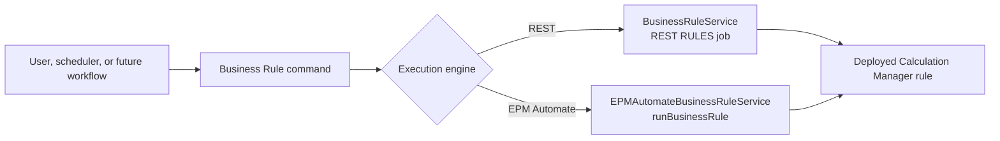

# From Scripts to a Framework: Building Oracle EPM Planning Automation with Python

## Part 5 — Executing Planning Business Rules with Runtime Prompts

In [Part 4](part-04-email-notifications.md), we added success and failure
notifications around every completed automation task. We can now add the
calculation layer: executing deployed Oracle Planning Business Rules.

This matters for workflows such as assumption-based planning:

```text
Load Volume and Average Selling Price
                    ↓
Run Calculate Vehicle Revenue
                    ↓
Review calculated results
```

This article implements the rule-execution capability itself through REST and
EPM Automate. Automatically chaining a specific data load to a specific rule
will remain a later orchestration feature.

---

## 1. Prerequisites

Before Python can execute a rule:

- Create the rule in Calculation Manager.
- Validate the rule.
- Deploy it to the Planning application and plan type.
- Test it manually in Planning.
- Configure any required runtime prompts and defaults.
- Grant the executing user launch access.

Oracle allows:

- Service Administrators
- Power Users with launch access to the rule

The framework executes an existing rule. It does not create, validate, or
deploy Calculation Manager artifacts.

---

## 2. One application capability, two adapters



Both engines receive:

- Exact rule name
- Zero or more runtime-prompt name/value pairs

Both return a successful terminal result or raise a meaningful framework
exception.

---

## 3. Configuration

Choose the default engine:

```dotenv
DEFAULT_BUSINESS_RULE_ENGINE=rest
```

Allowed values:

```text
rest
epmautomate
```

Non-interactive commands can override the default with `--engine`.

EPM Automate execution also requires the existing encrypted-file settings:

```dotenv
EPM_AUTOMATE_EXECUTABLE=C:\Program Files\Oracle\EPM Automate\bin\epmautomate.bat
EPM_AUTOMATE_PASSWORD_FILE=C:\Secure\EPMPassword.epw
EPM_AUTOMATE_COMMAND_TIMEOUT=1800
```

---

## 4. Discovering available rules

Oracle Planning can return job definitions filtered by:

```text
jobType=RULES
```

The framework reuses `JobService`:

```python
definitions = job_service.get_job_definitions(
    job_type="RULES"
)
```

Interactive output:

```text
Available Business Rules

1. Calculate Vehicle Revenue
2. Aggregate Plan
3. Clear Working Forecast
4. Enter another Business Rule name
0. Cancel
```

Definitions are sorted alphabetically by the existing job-discovery service.

The exact-name option is important for two reasons:

1. A newly deployed rule may not yet appear as expected.
2. Oracle documents launch access for Power Users, while listing job
   definitions can require broader permissions.

If Oracle returns HTTP 403 during definition discovery, the interactive
workflow explains the permission limitation and allows manual exact-name
entry. HTTP 401 is not treated as a discovery limitation because invalid
credentials must still fail immediately.

---

## 5. Runtime prompts

A runtime prompt is a value requested when a rule starts. Typical examples:

```text
Scenario=Plan
Version=Working
Entity=USA
Period=Jan
Year=FY26
```

Runtime prompt names and values are case-sensitive because Oracle’s job
parameters are case-sensitive.

During interactive execution, enter one pair at a time:

```text
Runtime prompt: Scenario=Plan
Runtime prompt: Version=Working
Runtime prompt: Entity=North America
Runtime prompt:
```

Pressing Enter finishes the list.

If no values are entered, Calculation Manager defaults are used. That works
only when every required prompt has a valid default.

The parser:

- Requires `NAME=VALUE`
- Splits only on the first equals sign
- Rejects empty names
- Rejects empty values
- Rejects duplicate prompt names
- Preserves insertion order

For example:

```text
Expression=Account=Revenue
```

becomes:

```python
{
    "Expression": "Account=Revenue"
}
```

---

## 6. Confirmation before execution

Interactive execution displays:

```text
Business Rule execution summary
Rule: Calculate Vehicle Revenue
Runtime prompts:
  Scenario = Plan
  Version = Working
  Entity = North America

Continue? [y/N]:
```

If no prompts were provided:

```text
Runtime prompts:
  Oracle/Calculation Manager defaults
```

Cancellation does not run the rule and does not send a success email.

---

## 7. REST implementation

Oracle’s Rules REST resource uses the Planning jobs endpoint:

```text
POST /HyperionPlanning/rest/v3/applications/{application}/jobs
```

Payload:

```json
{
  "jobType": "RULES",
  "jobName": "Calculate Vehicle Revenue",
  "parameters": {
    "Scenario": "Plan",
    "Version": "Working",
    "Entity": "USA"
  }
}
```

When defaults are used, the optional `parameters` object is omitted:

```json
{
  "jobType": "RULES",
  "jobName": "Calculate Vehicle Revenue"
}
```

`BusinessRuleService` validates the request, submits it through the shared
`EPMClient`, and returns:

```python
BusinessRuleSubmission(
    job_id=301,
    rule_name="Calculate Vehicle Revenue",
    runtime_prompts=(
        ("Scenario", "Plan"),
        ("Entity", "USA"),
    ),
)
```

The existing `JobMonitor` then polls the job ID, applies the common timeout,
and retrieves Planning diagnostics if the job fails.

---

## 8. EPM Automate implementation

The documented command is:

```text
epmautomate runBusinessRule RULE_NAME [PARAMETER=VALUE]
```

Example:

```text
epmautomate runBusinessRule "Calculate Vehicle Revenue" Scenario=Plan Version=Working Entity=USA
```

The Python adapter passes each value as an independent subprocess argument:

```python
result = self._client.run(
    "runBusinessRule",
    normalized_name,
    "Scenario=Plan",
    "Version=Working",
    "Entity=USA",
    check=False,
)
```

Because `shell=False` is used, a value such as `Entity=North America` remains
one argument without constructing a shell command string.

The EPM Automate client:

1. Logs in using the encrypted `.epw` file.
2. Runs the rule.
3. Converts a nonzero exit code into `EPMAutomateCommandError`.
4. Attempts logout even after rule failure.

---

## 9. Running a rule

### Interactive

```powershell
python main.py
```

Select:

```text
5. Run Business Rule
```

Then:

1. Select REST or EPM Automate.
2. Select a discovered rule or enter its exact name.
3. Enter optional runtime prompts.
4. Review and confirm.

### REST with default prompts

```powershell
python main.py rule `
  --engine rest `
  --rule "Calculate Vehicle Revenue"
```

### REST with runtime prompts

```powershell
python main.py rule `
  --engine rest `
  --rule "Calculate Vehicle Revenue" `
  --rtp "Scenario=Plan" `
  --rtp "Version=Working" `
  --rtp "Entity=North America"
```

### EPM Automate

```powershell
python main.py rule `
  --engine epmautomate `
  --rule "Calculate Vehicle Revenue" `
  --rtp "Scenario=Plan" `
  --rtp "Entity=USA"
```

Repeat `--rtp` for each prompt. Quote the complete argument in PowerShell when
the value contains spaces.

---

## 10. Logging and email notifications

Logs record:

- Rule name
- Execution engine
- Runtime-prompt names
- REST job ID
- Job status
- Completion or failure
- Execution duration

The Business Rule services do not log runtime-prompt values. This avoids
unnecessarily copying business inputs into operational logs.

Terminal email subjects look like:

```text
[Oracle EPM] SUCCESS: Business Rule execution - Calculate Vehicle Revenue
[Oracle EPM] FAILED: Business Rule execution - Calculate Vehicle Revenue
```

Notification delivery remains isolated from rule status. A successful
calculation remains successful even if SMTP delivery fails.

---

## 11. Errors and troubleshooting

### No rules appear

Confirm the rule is deployed to the expected Planning application. Use manual
entry only when you know the exact deployed name.

### HTTP 403 while listing rules

The user may have rule launch access without permission to retrieve all job
definitions. Use manual name entry or run the non-interactive command.

### Missing runtime prompt

Provide every prompt that does not have a valid Calculation Manager default:

```powershell
--rtp "Entity=USA"
```

Prompt names must match exactly, including capitalization.

### EPM Automate appears to ignore a prompt

Oracle documents that prompts not matching the rule definition exactly are
ignored. Check spelling, capitalization, and the deployed rule definition.

### Rule succeeds but calculated data is not visible

Check:

- The rule’s deployed plan type
- Scenario, Version, Entity, Year, and Period prompts
- Member access
- The form POV
- Whether the result is stored or dynamically calculated
- Whether aggregation is part of the rule

### Rule exceeds the monitoring timeout

REST uses `DEFAULT_JOB_TIMEOUT`. Increase it only after confirming the rule is
still running normally in the Oracle Jobs console.

---

## 12. Tests

The new tests verify:

- Exact REST `RULES` payload
- Optional parameter omission
- Runtime-prompt validation and order
- Immediate Oracle rejection
- EPM Automate command arguments
- Values containing spaces
- Calculation Manager defaults
- Logout after rule failure
- Interactive discovery and selection
- CLI parsing
- Values containing additional equals signs
- Both execution engines
- Existing command regression

At this milestone, the complete suite contains **122 passing tests**.

---

## 13. Current boundary and next step

Implemented:

- One Business Rule per command
- REST and EPM Automate
- Live rule discovery
- Manual exact-name fallback
- Optional runtime prompts
- Confirmation
- REST job monitoring and diagnostics
- Logging and email notification
- Interactive and non-interactive execution

Not implemented yet:

- Rulesets
- Automatically running a rule after a particular data load
- Named multi-step workflows
- Dependency graphs between loads and rules
- Retry policies for calculation failures

The next architectural step for the assumption example is not another data
loader. It is a workflow such as:

```text
Load assumptions
    ↓ only on success
Run Calculate Vehicle Revenue
    ↓ only on success
Send one workflow completion notification
```

That should be introduced explicitly so failures, retries, and notifications
have clear semantics.

---

## Official references

- [Oracle Planning Rules REST API](https://docs.oracle.com/en/cloud/saas/enterprise-performance-management-common/prest/rules.html)
- [Oracle Planning Get Job Definitions](https://docs.oracle.com/en/cloud/saas/enterprise-performance-management-common/prest/get_job_definitions.html)
- [Oracle EPM Automate runBusinessRule](https://docs.oracle.com/en/cloud/saas/enterprise-performance-management-common/cepma/epm_auto_run_business_rule.html)
- [Oracle runtime prompts](https://docs.oracle.com/en/cloud/saas/enterprise-performance-management-common/usgsv/entering_runtime_prompts_302.html)

---

## Continue the series

Next: [Part 6 — Dynamic Data Integration Pipelines with Safe Multi-File Handling](part-06-data-integration-pipelines.md)
