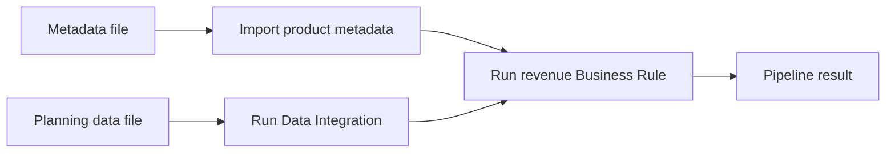
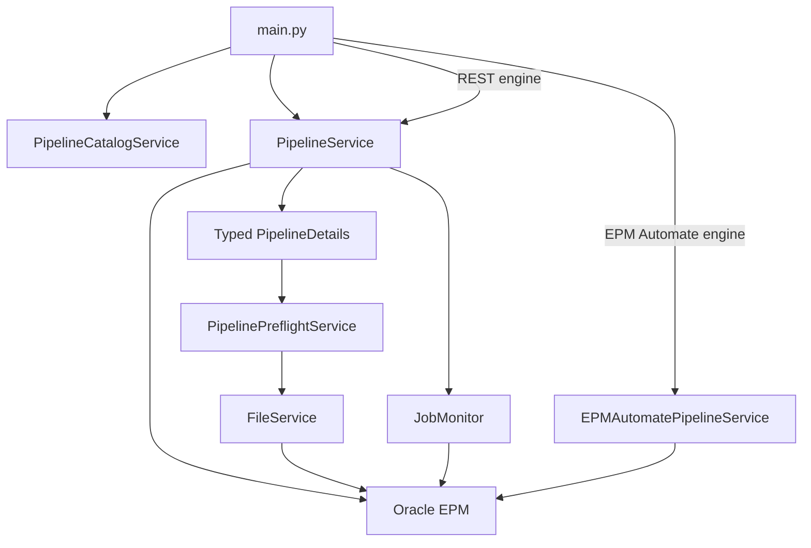
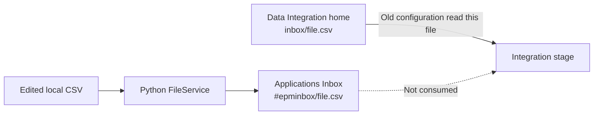
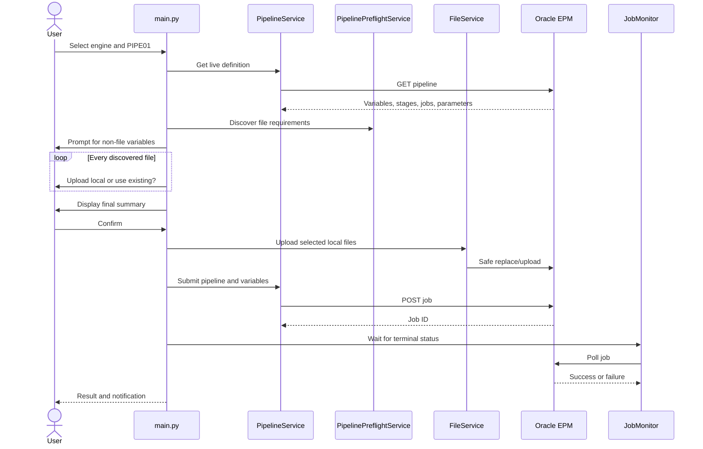

# From Scripts to a Framework: Building Oracle EPM Planning Automation with Python

## Part 6 — Dynamic Data Integration Pipelines with Safe Multi-File Handling

In [Part 5](part-05-business-rules.md), we added Business Rule execution with
runtime prompts. We can now orchestrate several Oracle EPM operations as one
controlled process by running a Data Integration Pipeline.

A pipeline can contain metadata imports, Data Integration loads, Business
Rules, file operations, and other jobs. The Python framework should not need
pipeline-specific code every time an administrator changes those stages.

That leads to the main design goal for this milestone:

> Retrieve the live pipeline definition from Oracle, discover its runtime
> inputs, prepare any required files, and execute it through a generic service.

---

## 1. What this milestone implements

The framework now supports:

- Selecting a configured pipeline or entering its code
- Retrieving live variables, stages, jobs, and job parameters
- Prompting dynamically for runtime variables
- Discovering zero, one, or many external file inputs
- Uploading a different local file for each input
- Reusing files that already exist in Oracle
- Safe file replacement in Applications Inbox
- Correct `#epminbox/` references for Data Integration
- Planning metadata and Data Integration files in the same pipeline
- Custom variables that can supply Business Rule RTP values
- REST execution with asynchronous job monitoring
- EPM Automate execution with encrypted credentials
- Confirmation, logging, exceptions, and terminal email notifications
- Interactive and non-interactive execution

The pipeline must already exist in Oracle Data Integration. The framework
executes and monitors it; it does not create or modify its Oracle definition.

---

## 2. Example business process

Our example pipeline is:

```text
Code: PIPE01
Name: PL_ProductRevenueForecast
```

It can orchestrate operations such as:



The exact order and parallel behavior remain controlled by the Oracle
pipeline. Python treats the pipeline as a deployed Oracle artifact and
supplies its runtime inputs.

---

## 3. Oracle-side configuration

### 3.1 Runtime variables

The example uses these standard variables:

```text
STARTPERIOD
ENDPERIOD
IMPORTMODE
EXPORTMODE
SEND_MAIL
SEND_TO
ATTACH_LOGS
```

It also uses two custom FILE variables:

```text
METADATA_FILE
DATA_FILE
```

The files are separate because their consuming Oracle jobs use different
file-reference conventions.

### 3.2 Metadata job

Configure the metadata job parameter as:

```text
Import File Name = $METADATA_FILE
```

The live REST definition then contains a relationship similar to:

```text
METADATA_FILE
    -> Job_Metadata_Load_Test
    -> importMetadata
    -> importZipFileName
```

### 3.3 Data Integration job

For a local file uploaded by the framework:

1. Leave the underlying file-based integration's **Directory** option blank.
2. Create `DATA_FILE` with validation type **FILE**.
3. Configure the Integration job's **File Name** as:

```text
$DATA_FILE
```

The live definition then contains:

```text
DATA_FILE
    -> Test_Product_Data_Load
    -> integration
    -> fileName
```

The framework uploads the selected local file to Applications Inbox and
passes:

```text
DATA_FILE=#epminbox/Test_Sales_DataLoad_V2.csv
```

### 3.4 Business Rule RTPs inside a pipeline

A Business Rule stage may require runtime prompts. Expose each prompt as a
pipeline variable instead of hardcoding it in Python.

For example:

```text
Pipeline variable:
    Name: RTP_SCENARIO
    Validation type: Text
    Required: Yes

Business Rule job parameter:
    Scenario = $RTP_SCENARIO
```

The framework retrieves `RTP_SCENARIO` with the other live variables and asks
for its value. The same approach works for Entity, Version, Year, or another
RTP configured as a pipeline job parameter.

The framework does not inspect the Calculation Manager rule from inside the
pipeline. The Oracle pipeline definition is the contract mapping pipeline
variables to the rule's RTP parameters.

---

## 4. Configuration files

Add the default engine and optional default code to `.env`:

```dotenv
DEFAULT_PIPELINE_ENGINE=rest
DEFAULT_PIPELINE_CODE=PIPE01
PIPELINE_CATALOG_FILE=config/pipelines.json
```

Allowed engines:

```text
rest
epmautomate
```

The catalog is a convenient selection list:

```json
{
  "pipelines": [
    {
      "code": "PIPE01",
      "name": "PL_ProductRevenueForecast",
      "description": "Product revenue forecast pipeline"
    }
  ]
}
```

Oracle's API retrieves one exact pipeline code. The framework therefore keeps
a small local catalog for interactive discovery while allowing manual entry.

The immutable code is used for execution:

```text
PIPE01
```

The display name is shown to the user:

```text
PL_ProductRevenueForecast
```

---

## 5. Architecture

Pipeline support is divided across focused components:

| Component | Responsibility |
|---|---|
| `PipelineCatalogService` | Loads the optional local selection catalog |
| `PipelineService` | Retrieves details, submits REST jobs, and reads status |
| `EPMAutomatePipelineService` | Runs `runPipeline` with encrypted credentials |
| `PipelinePreflightService` | Discovers and prepares external file inputs |
| `FileService` | Uploads and safely replaces Applications Inbox files |
| `PipelineDetails` and related models | Represent variables, stages, jobs, and parameters |
| `PipelineFileRequirement` | Describes one file required by one or more jobs |
| `PipelineFileSelection` | Records whether to upload or reuse an Oracle file |
| `JobMonitor` | Polls REST jobs until a terminal state |
| `main.py` | Coordinates interactive and command-line workflows |



This separation prevents discovery, HTTP transport, subprocess handling, and
interactive prompting from becoming one large script.

---

## 6. Retrieving the live definition

The REST resource is:

```text
GET /aif/rest/V1/pipeline?pipelineName=PIPELINE_CODE
```

Oracle requires the pipeline **code**, not the display name.

The service method remains small:

```python
def get_pipeline_details(self, pipeline_code: str) -> PipelineDetails:
    normalized_code = self.validate_pipeline_code(pipeline_code)
    response = self._client.get(
        "aif/rest/V1/pipeline",
        params={"pipelineName": normalized_code},
    )
    ...
    return PipelineDetails.from_response(response["response"])
```

`PipelineDetails.from_response()` converts the response into immutable models:

```text
PipelineDetails
  variables[]
  stages[]
    jobs[]
      parameters[]
```

Variables, stages, and jobs are sorted using Oracle sequence values. This
keeps prompts and summaries aligned with the administrator's configuration.

---

## 7. Dynamic runtime variables

The framework does not maintain a Python list of custom variables. It iterates
through the live variables:

```python
for variable in details.variables:
    ...
    value = input_func(
        f"{variable.display_name} ({variable.name})"
        f"{default_hint}: "
    )
```

FILE variables are handled by pre-flight and are not asked twice.

Standard values are normalized:

```text
replace -> Replace
merge -> Merge
no -> No
yes -> Y
```

Validation rejects:

- Empty names
- Empty required values
- Duplicate command-line variables
- Variables absent from the live definition
- Invalid import, export, mail, or attach-log options
- Native pipeline email without `SEND_TO`

This dynamic design supports future custom RTP variables without a code
change.

---

## 8. Generic file discovery

A pipeline may require no file, one file, or several independent files. It may
also combine local uploads with files already in Oracle.

`PipelinePreflightService` discovers:

- Variables whose validation type is `FILE`
- Text variables referenced by file-consuming parameters
- Fixed `fileName`, `inputFileName`, `importFileName`,
  `importZipFileName`, `sourceFileName`, and `zipFileName` values
- The stage and job consuming each input

Supported consumers currently include:

```text
integration
importData
importMetadata
importMapping
importSecurity
importExchangeRates
importValidIntersections
importCellLevelSecurity
```

A discovered input is represented as:

```python
PipelineFileRequirement(
    key="DATA_FILE",
    display_name="Data File",
    variable_name="DATA_FILE",
    configured_reference="Test_Sales_DataLoad_V2.csv",
    allowed_extensions=frozenset({".csv", ".txt", ".zip"}),
    consumers=(...),
    required=True,
)
```

Because discovery uses the live definition, another pipeline can add or remove
file variables without pipeline-code-specific Python branches.

---

## 9. The two-Inbox problem

Oracle file locations can look similar without being interchangeable:

| File reference | Location |
|---|---|
| `#epminbox/FileName.csv` | Applications Inbox/Outbox Explorer |
| `inbox/FileName.csv` | Data Integration home |
| `FileName.csv` | Relative to the integration's configured directory |

The shared REST uploader writes to Applications Inbox.

The original configuration used:

```text
Integration Directory: inbox/
Pipeline File Name: Test_Sales_DataLoad_V2.csv
```

Python successfully replaced:

```text
#epminbox/Test_Sales_DataLoad_V2.csv
```

But the Integration stage continued reading:

```text
inbox/Test_Sales_DataLoad_V2.csv
```

That produced a successful pipeline using stale data. The upload was correct;
the consumer read another repository.



---

## 10. Repository-aware references

The reference is selected from the consuming job type:

```python
def local_upload_oracle_reference(
    requirement: PipelineFileRequirement,
    local_path: str | Path,
) -> str:
    file_name = Path(local_path).name

    if requirement.is_data_integration_input:
        return f"#epminbox/{file_name}"

    return file_name
```

The production implementation also handles fixed references, mixed consumers,
missing names, and meaningful configuration errors.

For a local Data Integration upload:

```text
Local path:
D:\Loads\LatestSales.csv

Uploaded name:
LatestSales.csv

Pipeline variable:
DATA_FILE=#epminbox/LatestSales.csv
```

For a local metadata upload:

```text
Local path:
D:\Loads\Product_Metadata_Load.csv

Pipeline variable:
METADATA_FILE=Product_Metadata_Load.csv
```

The framework blocks a fixed plain Data Integration filename from being used
with the Applications Inbox uploader. This prevents the stale-file defect from
silently returning.

If one variable is shared by both Data Integration and a Planning import job,
local upload is rejected. Configure separate FILE variables because the
consumers require different reference formats.

---

## 11. File replacement

Local uploads reuse `FileService`.

If the exact target already exists:

1. The service identifies the "already exists" response.
2. It deletes only that exact target filename.
3. It uploads the new file.
4. It preserves unrelated Inbox files.

Pre-flight extracts the upload target from the reference:

```text
#epminbox/LatestSales.csv
              |
              +-- upload target: LatestSales.csv
```

No delete or upload occurs until interactive confirmation is accepted.

---

## 12. Interactive flow

Run:

```powershell
python main.py
```

Select:

```text
6. Run Data Integration Pipeline
```



For each file:

```text
Input 1: Metadata File
Key: METADATA_FILE
Used by: Metadata Maintainance / Job_Metadata_Load_Test

1. Upload a local file
2. Use a file already in the Oracle Inbox
0. Cancel pipeline execution
```

Drag and drop is accepted for a local Windows path.

The final summary includes:

- Engine
- Pipeline display name and code
- Stage and job counts
- Every selected file
- Whether each file is uploaded or reused
- Every resolved runtime variable

---

## 13. REST execution

The REST job endpoint is:

```text
POST /aif/rest/V1/jobs
```

Example payload:

```json
{
  "jobName": "PIPE01",
  "jobType": "pipeline",
  "variables": {
    "STARTPERIOD": "Jan-26",
    "ENDPERIOD": "Mar-26",
    "IMPORTMODE": "Replace",
    "EXPORTMODE": "Merge",
    "SEND_MAIL": "No",
    "ATTACH_LOGS": "N",
    "METADATA_FILE": "Product_Metadata_Load.csv",
    "DATA_FILE": "#epminbox/Test_Sales_DataLoad_V2.csv"
  }
}
```

Oracle returns a process ID. `JobMonitor` polls the Data Integration job
resource until success, failure, or timeout.

The result is printed with the job ID and duration. Failures become framework
exceptions and include available Oracle diagnostics.

---

## 14. EPM Automate execution

The equivalent command is:

```text
epmautomate runPipeline PIPELINE_CODE [PARAMETER=VALUE]
```

Example:

```text
epmautomate runPipeline PIPE01 STARTPERIOD=Jan-26 ENDPERIOD=Mar-26 IMPORTMODE=Replace EXPORTMODE=Merge SEND_MAIL=No ATTACH_LOGS=N DATA_FILE=#epminbox/Test_Sales_DataLoad_V2.csv
```

The adapter:

1. Logs in with the encrypted `.epw` file.
2. Calls `runPipeline`.
3. Passes each variable as an independent subprocess argument.
4. Converts a nonzero exit code into `EPMAutomateCommandError`.
5. Attempts logout after failure.

Interactive EPM Automate execution still uses REST first to retrieve the live
definition and perform selected uploads.

For non-interactive EPM Automate, stage files before launching the command.
Unattended file-discovery options currently use the REST workflow because
discovery requires an authenticated REST connection.

---

## 15. Command-line examples

### REST with two local files

```powershell
python main.py pipeline `
  --engine rest `
  --pipeline PIPE01 `
  --pipeline-upload "DATA_FILE=D:\Loads\LatestSales.csv" `
  --pipeline-upload "METADATA_FILE=D:\Loads\Product_Metadata_Load.csv" `
  --variable "STARTPERIOD=Jan-26" `
  --variable "ENDPERIOD=Mar-26" `
  --variable "IMPORTMODE=Replace" `
  --variable "EXPORTMODE=Merge" `
  --variable "SEND_MAIL=No" `
  --variable "ATTACH_LOGS=N"
```

### Local data and existing metadata

```powershell
python main.py pipeline `
  --engine rest `
  --pipeline PIPE01 `
  --pipeline-upload "DATA_FILE=D:\Loads\LatestSales.csv" `
  --pipeline-inbox "METADATA_FILE=Product_Metadata_Load.csv" `
  --variable "STARTPERIOD=Jan-26" `
  --variable "ENDPERIOD=Mar-26"
```

### Existing Data Integration file

When intentionally using Data Integration home:

```powershell
--pipeline-inbox "DATA_FILE=inbox/Test_Sales_DataLoad_V2.csv"
```

### Existing Applications Inbox file

```powershell
--pipeline-inbox "DATA_FILE=#epminbox/Test_Sales_DataLoad_V2.csv"
```

The existing-file option preserves the exact Oracle reference entered.

### Business Rule RTP variable

If the pipeline exposes `RTP_SCENARIO`:

```powershell
python main.py pipeline `
  --engine rest `
  --pipeline PIPE01 `
  --variable "RTP_SCENARIO=Forecast" `
  --variable "STARTPERIOD=Jan-26" `
  --variable "ENDPERIOD=Mar-26"
```

### EPM Automate

```powershell
python main.py pipeline `
  --engine epmautomate `
  --pipeline PIPE01 `
  --variable "STARTPERIOD=Jan-26" `
  --variable "ENDPERIOD=Mar-26"
```

---

## 16. Logging and notifications

The workflow logs:

- Authentication
- Pipeline code
- Live-definition retrieval
- Discovered file count
- Upload or existing-file selection
- HTTP request and response status
- Submission
- Job ID and status changes
- Completion, failure, or timeout
- Duration

Passwords and encrypted password contents are never logged.

The framework sends a terminal notification, for example:

```text
[Oracle EPM] SUCCESS: Data Integration Pipeline execution - PIPE01
[Oracle EPM] FAILED: Data Integration Pipeline execution - PIPE01
```

Oracle native email can also use:

```text
SEND_MAIL
SEND_TO
ATTACH_LOGS
```

During development, keep `SEND_MAIL=No` if framework email is enabled to avoid
duplicate messages.

---

## 17. Troubleshooting

### The pipeline loads an older data file

Check the repository reference:

```text
#epminbox/file.csv  -> Applications Inbox
inbox/file.csv      -> Data Integration home
```

For framework uploads, bind the Integration job to a FILE variable and let
Python pass `#epminbox/<file>`.

### A fixed Integration filename is rejected

This is intentional for a local framework upload. A plain fixed name may
resolve under the integration's Directory. Convert it to a dedicated FILE
variable.

### The upload succeeds but the pipeline cannot find the file

Confirm:

- The integration Directory is blank for `#epminbox` usage.
- The Integration job File Name is `$DATA_FILE`.
- The runtime value contains `#epminbox/`.
- The name and extension match exactly.

### Metadata import cannot find its file

Planning metadata import normally expects a plain Applications Inbox name:

```text
METADATA_FILE=Product_Metadata_Load.csv
```

### A required variable is missing

Supply it with:

```powershell
--variable "VARIABLE_NAME=VALUE"
```

Or configure a valid Oracle default.

### Native email is enabled but execution is rejected

Provide `SEND_TO` whenever `SEND_MAIL` is not `No`.

### EPM Automate cannot prepare local files non-interactively

Stage the files first or use REST with `--pipeline-upload`.

### The pipeline code is rejected

Use the immutable code, such as `PIPE01`, rather than the display name.

---

## 18. Tests

Pipeline coverage includes:

- Live-definition parsing and ordering
- Pipeline-code validation
- REST payload generation
- Dynamic variable validation and normalization
- Required variables and native email validation
- Local catalog parsing and interactive selection
- Zero, one, and multiple file discovery
- FILE and referenced TEXT variables
- Fixed file parameters
- Local file validation
- Data Integration `#epminbox/` resolution
- Metadata filename resolution
- Stale-repository protection
- Safe upload target selection
- Interactive and non-interactive file options
- EPM Automate arguments and logout after failure
- Existing command regression

At the end of this milestone:

```text
144 passed
```

---

## 19. Current boundary

Implemented:

- Existing Pipeline execution
- REST and EPM Automate engines
- Dynamic runtime variables
- Multiple external files
- Data Integration and Planning Inbox semantics
- Business Rule RTP values exposed as Pipeline variables
- File replacement
- Job monitoring and diagnostics
- Logging and notifications

Not implemented yet:

- Creating or editing Oracle pipelines from Python
- Pipeline scheduling
- Automatic retry policies
- Pipeline-specific restart points
- Downloading and packaging every stage log
- Rulesets as a standalone command
- Data Maps
- OAuth 2 authentication
- AI-agent orchestration

Future features can reuse the same client, typed models, monitoring,
configuration, and notification foundations.

---

## Official references

- [Oracle Get Pipeline Details REST API](https://docs.oracle.com/en/cloud/saas/enterprise-performance-management-common/prest/get_pipeline.html)
- [Oracle Editing Runtime Variables](https://docs.oracle.com/en/cloud/saas/enterprise-performance-management-common/diepm/integrations_pipeline_variables.html)
- [Oracle Integration Pipeline Job Type](https://docs.oracle.com/en/cloud/saas/epm-cloud/diepm/integrations_pipeline_integration.html)
- [Oracle Run Integrations REST API](https://docs.oracle.com/en/cloud/saas/enterprise-performance-management-common/prest/fdmee_integration_jobtype_106x0fea7396.html)
- [Oracle EPM Automate runPipeline](https://docs.oracle.com/en/cloud/saas/enterprise-performance-management-common/cepma/epm_auto_run_pipeline.html)

---

## Continue the series

Next planned milestone: Data Maps, scheduling, or deeper job-log handling.
