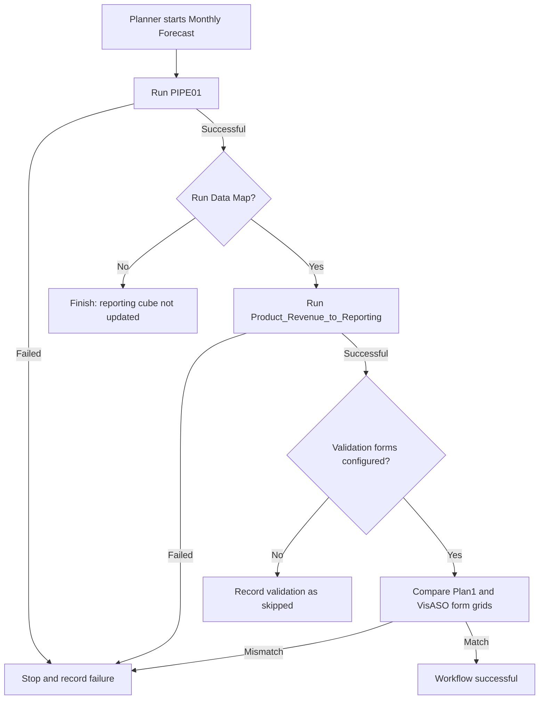

# Part 7 — From Separate Commands to a Controlled Monthly Forecast Workflow

The framework can already load metadata and data, run integrations, execute
Business Rules, and launch Data Integration Pipelines. A real planning cycle,
however, is not a collection of unrelated buttons. Each task must run in the
correct order, later tasks must stop when an earlier task fails, and the final
published result must be verifiable.

This milestone introduces three production-oriented capabilities:

1. standalone Planning Data Map execution;
2. a reusable, fail-fast workflow engine with durable run history; and
3. automated source-to-target validation using Planning forms.

The first workflow built on these capabilities is `MONTHLY_FORECAST`.

## The business process

The current Oracle Pipeline, `PIPE01`, performs the configured forecast
stages. After it succeeds, the user can publish Product Revenue data from
`Plan1` to `VisASO` through the existing
`Product_Revenue_to_Reporting` Data Map.



Skipping the map is a valid outcome when consultants want to inspect a working
forecast before publishing it. The console states clearly that the reporting
cube was not updated.

## Why the Data Map remains an Oracle artifact

Python does not recreate the mappings configured in Planning. The
administrator remains responsible for source and target cubes, dimension
mappings, member selections, target-only members such as
`HSP_View=BaseData`, and launch access.

Python is responsible for controlled execution, monitoring, optional runtime
overrides, error handling, history, and validation.

The REST payload is built by `DataMapService`:

```json
{
  "jobType": "PLAN_TYPE_MAP",
  "jobName": "Product_Revenue_to_Reporting",
  "parameters": {
    "clearData": false
  }
}
```

For a temporary slice, the REST engine can add documented member overrides:

```json
{
  "overrideMembersMap": {
    "Period": "Jan,Feb,Mar",
    "Year": "FY26"
  },
  "overrideExclusionMembersMap": {
    "Entity": "No Entity"
  }
}
```

The EPM Automate service executes:

```text
epmautomate runPlanTypeMap Product_Revenue_to_Reporting clearData=false
```

Member overrides are REST-only because `runPlanTypeMap` does not expose the
same override maps.

## Safe target clearing

The framework does not silently clear target data. The current policy is:

```dotenv
MONTHLY_FORECAST_CLEAR_TARGET=false
```

This is not a universal recommendation. A production consultant should decide
based on the mapped slice, replace semantics, and whether stale target
intersections can remain when source values disappear.

## A reusable workflow engine

The workflow engine does not contain Pipeline or Data Map API code. It accepts
ordered steps and applies shared rules:

- generate a unique execution ID;
- execute enabled steps in sequence;
- persist state before and after every step;
- stop at the first failure;
- mark dependent steps as skipped; and
- preserve the original error.

```python
run = engine.run(
    "MONTHLY_FORECAST",
    (
        WorkflowStep("Run Planning Pipeline", run_pipeline),
        WorkflowStep(
            "Publish Reporting Data Map",
            run_data_map,
            enabled=publish_reporting,
        ),
        WorkflowStep(
            "Validate Source and Target",
            validate,
            enabled=validation_is_configured,
        ),
    ),
)
```

The existing Pipeline service is called as a step. Its live variable
discovery, multi-file pre-flight, repository-aware upload, monitoring, and
failure diagnostics are reused unchanged.

## Durable run history

`SQLiteWorkflowRepository` stores workflow headers and ordered step results:

```text
var/workflow_history.sqlite3
```

Each record includes the execution ID, workflow and step statuses, timestamps,
returned details, and bounded failure messages. SQLite requires no server for
local development. Its repository interface lets a future FastAPI application
move history to PostgreSQL without changing the workflow engine.

## Automated validation

A successful Data Map means Oracle completed the copy; it does not prove the
business slice has the expected values. Create two Planning forms:

- one reading the required `Plan1` source slice;
- one reading the matching `VisASO` target slice.

The forms must use the same row and column dimensions, member order, POV, and
aggregation level. Then configure:

```dotenv
VALIDATION_SOURCE_FORM=VF_ProductRevenue_Plan1
VALIDATION_TARGET_FORM=VF_ProductRevenue_VisASO
VALIDATION_TOLERANCE=0.01
```

`DataValidationService` exports both JSON grids and compares corresponding
numeric cells. Missing source and target values match each other; missing
versus zero is a mismatch. A tolerance handles legitimate rounding.

If the forms are not configured yet, validation is explicitly recorded as
skipped. This permits workflow development without pretending an automated
control exists.

## Running interactively

```powershell
python main.py
```

The menu now includes:

```text
7. Run Data Map
8. Run Monthly Forecast Workflow
```

Standalone execution lists saved `PLAN_TYPE_MAP` jobs. Monthly Forecast reuses
the complete interactive Pipeline experience, asks whether reporting should
be published, and defaults target clearing to **No**.

## Running unattended

```powershell
python main.py workflow `
  --pipeline PIPE01 `
  --data-map "Product_Revenue_to_Reporting" `
  --variable "STARTPERIOD=Jan-26" `
  --variable "ENDPERIOD=Mar-26" `
  --variable "IMPORTMODE=Replace" `
  --variable "EXPORTMODE=Merge" `
  --variable "SEND_MAIL=No" `
  --variable "ATTACH_LOGS=N" `
  --no-clear-target
```

Existing `--pipeline-upload` and `--pipeline-inbox` options are supported. Use
`--skip-data-map` to calculate without publishing.

## Failure and notification behavior

One workflow command produces one terminal framework notification. Internal
steps do not send duplicate success emails. When a step fails, its failure is
persisted, dependent steps are skipped, the workflow is marked failed, and the
existing notification layer sends the workflow failure.

## Testing

The new tests verify the exact Data Map payload, clear and override behavior,
Oracle submission errors, numeric tolerance, missing-value comparison,
workflow ordering, skipped steps, stop-on-failure behavior, and durable SQLite
history. The full suite contains 151 passing tests and never calls a live
Oracle environment.

## What comes next

This milestone creates the boundary needed for a future web application and AI
agent. FastAPI can expose approved workflows and run history. An agent can
later select a workflow, collect inputs, explain failures, and summarize
results without bypassing the typed services, confirmations, permissions, or
audit trail introduced here.
