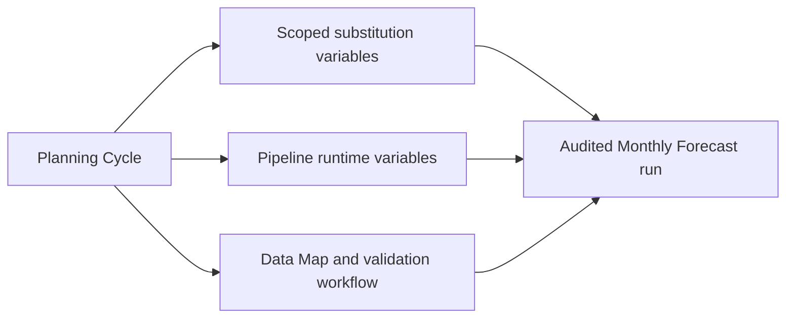

# Part 8 — Planning Cycle Control with Scoped Variables and Safe Pre-flight

The Monthly Forecast workflow established the correct technical sequence:
Pipeline, optional Data Map, validation, history, and notification. The next
problem is operational: a consultant must run the same process for a different
year and period without editing Python or entering the same values repeatedly.

Planning Cycle Control adds a business-level input layer over the existing
workflow.

## From technical parameters to a planning cycle

The operator supplies:

```text
Year: FY26
Start Period: Jan
End Period: Mar
Scenario: Forecast
Version: Working
```

The framework translates those values into the artifacts that need them:



This translation keeps a period member such as `Jan` separate from a Data
Integration period such as `Jan-26`. Therefore, `CurMonth` can receive `Jan`
while `STARTPERIOD` receives `Jan-26`.

## Discovering rather than hardcoding variables

Oracle Planning can define substitution variables for all cubes or for one
plan type. `SubstitutionVariableService` calls the application-level REST
resource and normalizes each returned item:

```json
{
  "name": "CurYr",
  "value": "FY25",
  "planType": "ALL"
}
```

The service also uses the newer Get Plan Types API when it is available.
Older environments may return HTTP 404 for that endpoint, so the service
falls back to the scopes returned by substitution-variable discovery.

This fallback was verified against the current Vision environment. It
discovered 34 variables, all currently defined at `ALL` scope.

## Initial role mapping

The first interactive run displays every discovered variable with its current
scope and value. The consultant may map one or more variables to:

- Year
- Start Period
- End Period
- Scenario
- Version

One role can update multiple variables, but one variable cannot be assigned to
multiple roles. The selections are saved in:

```text
config/planning_cycles.json
```

Example:

```json
{
  "code": "MONTHLY_FORECAST",
  "displayName": "Monthly Forecast",
  "pipelineCode": "PIPE01",
  "dataMapName": "Product_Revenue_to_Reporting",
  "variableBindings": [
    {
      "role": "YEAR",
      "variableName": "CurYr",
      "scope": "ALL"
    },
    {
      "role": "START_PERIOD",
      "variableName": "CurMonth",
      "scope": "ALL"
    }
  ]
}
```

The framework updates only variables returned by Oracle. A misspelled or stale
mapping is rejected instead of creating a new variable accidentally.

## Standalone variable maintenance

Planning Cycle mappings are not the only time an administrator needs to
manage a variable. Menu option 12 provides a separate REST-only maintenance
screen:

```text
1. List variables
2. Update an existing variable
3. Create a new variable
0. Return
```

Update starts from the discovered list, so scope and spelling are not
re-entered. Create is explicit: the administrator selects `ALL`, a discovered
cube, or enters an exact cube name, then provides the new name and value.

The paths never silently cross. Update refuses an unknown definition and
Create refuses a scoped name that already exists. Both show a final summary,
default confirmation to No, and retrieve the variable again to verify it.

Non-interactive equivalents are:

```powershell
python main.py variables
python main.py variables --set-subvar "ALL.CurYr=FY26"
python main.py variables --create-subvar "Plan1.ForecastEnd=Mar"
```

## Pre-flight before mutation

Before any state changes, the pre-flight service verifies:

- required cycle inputs;
- configured Pipeline code;
- configured Data Map name;
- every scoped variable mapping;
- live Pipeline runtime-variable names; and
- proposed old and new variable values.

The complete plan is displayed before interactive approval. A cancellation at
this stage changes nothing in Oracle.

## Audited variable updates

Approved variable changes become the first workflow step:

```text
1. Update Planning Cycle Variables
2. Run Planning Pipeline
3. Publish Reporting Data Map
4. Validate Source and Target
```

Updates are grouped by scope and sent through the corresponding REST resource.
The service retrieves the variables again and verifies that Oracle returned
the requested values. If verification fails, the workflow stops and the
Pipeline does not start.

The framework does not automatically roll variables back if a later business
step fails. The before-and-after values are retained in SQLite, allowing a
consultant to make an informed recovery decision.

## Reusing the existing workflow

Planning Cycle Control does not duplicate Pipeline or Data Map logic. It sets
approved defaults and calls the same Monthly Forecast orchestration already
used by the standalone command. Interactive users retain:

- live Pipeline variable prompts;
- safe file discovery and upload;
- the choice to publish through the Data Map;
- target-clear confirmation; and
- automatic validation when forms are configured.

## Workflow history viewer

SQLite history can now be read from the menu or command line:

```powershell
python main.py history --history-limit 20
python main.py history --execution-id EXECUTION_ID
```

The detail view shows step order, status, timestamps, structured details, and
failure messages. Logs remain the source for low-level HTTP diagnostics;
SQLite is the process audit record.

## Safe Cube Refresh

Metadata imports may require a cube refresh, but forecast calculations do not.
Cube Refresh is therefore a standalone REST service and an optional
post-metadata action.

After interactive metadata success, the default answer remains No. If the user
requests a refresh, the framework lists saved `CUBE_REFRESH` definitions and
requires a second confirmation. It never invents a job name.

The current Vision environment exposes a saved job named `RefreshCube`, even
though no custom refresh job had been created. Only discovery was performed
during development; the job was not executed.

Run explicitly:

```powershell
python main.py refresh-cube --refresh-job "RefreshCube"
```

## REST-first decision

No new EPM Automate service was added. Substitution-variable discovery,
updates, verification, pre-flight, history, and Cube Refresh all have suitable
REST or local implementations. This avoids maintaining a second path where it
would not add meaningful value.

## Tests and verification

The test suite covers:

- application- and cube-scoped discovery;
- older-version plan-type fallback;
- protection against accidental variable creation;
- grouped REST update payloads;
- post-update verification;
- cycle configuration persistence;
- member-period and Pipeline-period translation;
- pre-flight artifact checks;
- Cube Refresh payload and rejection handling; and
- recent workflow history retrieval.

All tests use mocks and do not modify Oracle. A separate live, read-only
pre-flight confirmed `PIPE01`, `Product_Revenue_to_Reporting`, 34 substitution
variables, and the expected `STARTPERIOD` and `ENDPERIOD` translations.
